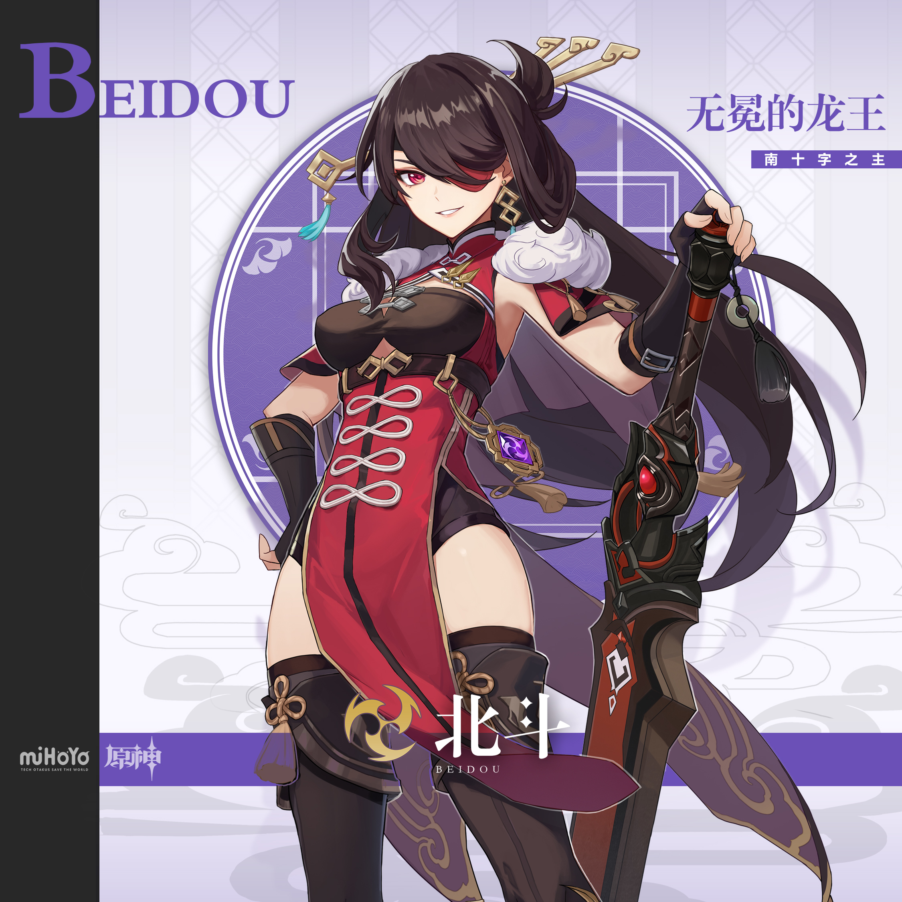
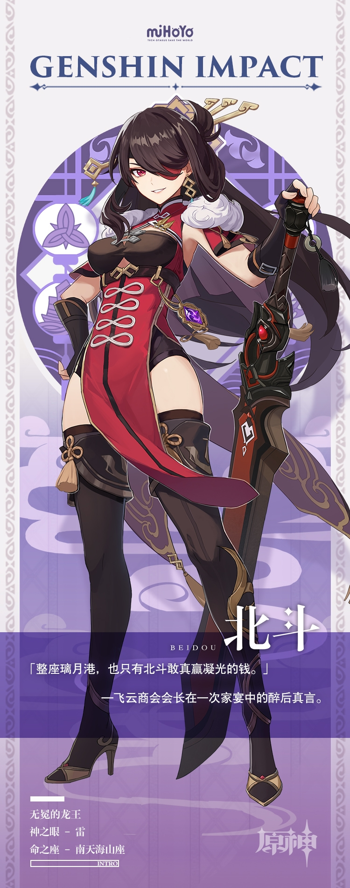

# 龙王巡海，风卷云来。

几乎每个璃月人都知道「南十字」船队大姐头北斗的威名，茶余饭后也爱聊起她。

码头边，船员们绘声绘色地描述北斗斩杀冥海巨兽「海山」的场面。

饭局上，商人们争相讨论北斗主导的一次次违律商运与其招致的天价罚款。

但对「南十字」的船员们来说，最值得一谈的，还是北斗从凝光手里赢到了摩拉。

具体金额不详，比试次数也无从考证，但船员们都看见北斗醉醺醺地回到船上。瞧她那模样，绝对是已经痛饮了一场。

「下次得让那女人倾家荡产！」北斗说着，躺倒在甲板上。

如此豪言壮语…船员们就权当它是大姐头酒后的玩笑话了。