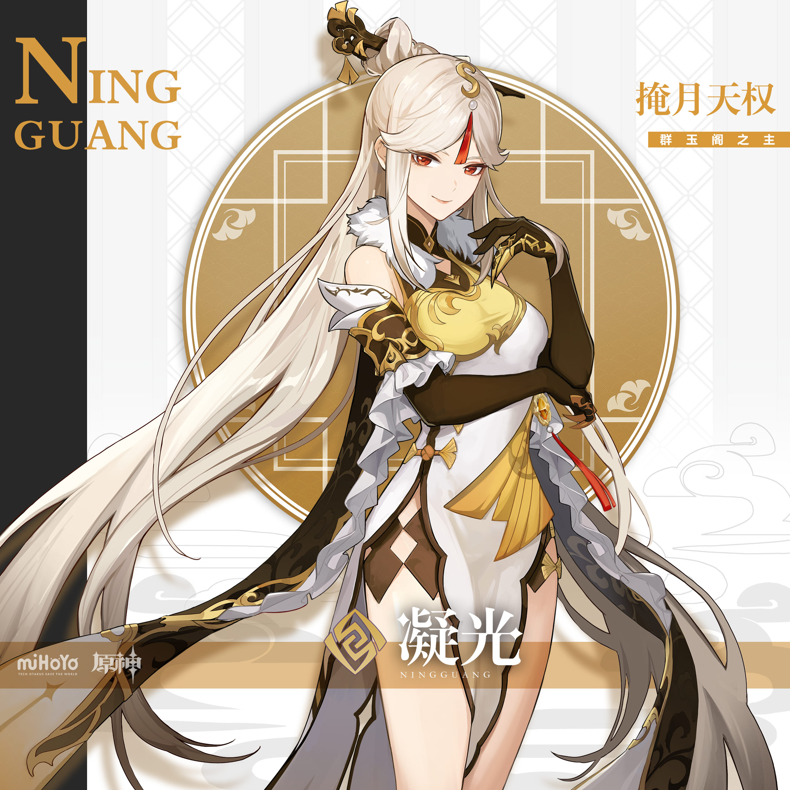
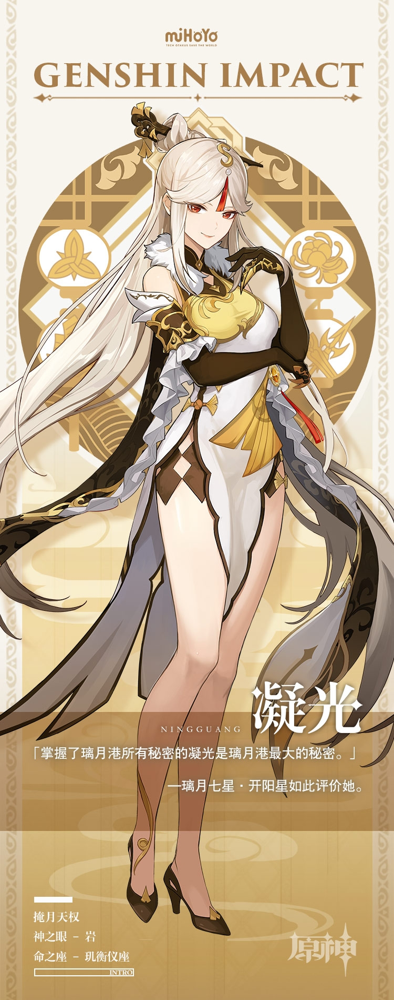

# 珍如宝钻，远如星幽

凝光是掌管重权的「璃月七星」之一，居天权星之位，识人心，擅话术。即使在人人经商的璃月港，她也是首屈一指的大商人。

每个见过凝光的人都会被她惊人的洞察力与过人的头脑折服。不仅如此，凝光的作风也极为独特。

她斥巨资搜集来大量浮空石制成基盘，又在其上建造出一座空前华美的宫殿。浮空石托起空中幻城，使之终年悬浮在璃月港上空。

这座宫阁正如凝光本人一般，高不可测，远离众生，却轻易吸引了所有目光。

震动商界的女富商、孩子们最喜欢的温柔姐姐、玉京台宴会上的名媛、甜食界的鉴赏名家……她是千面佳人，也是一个永远无法读懂的美丽谜题。