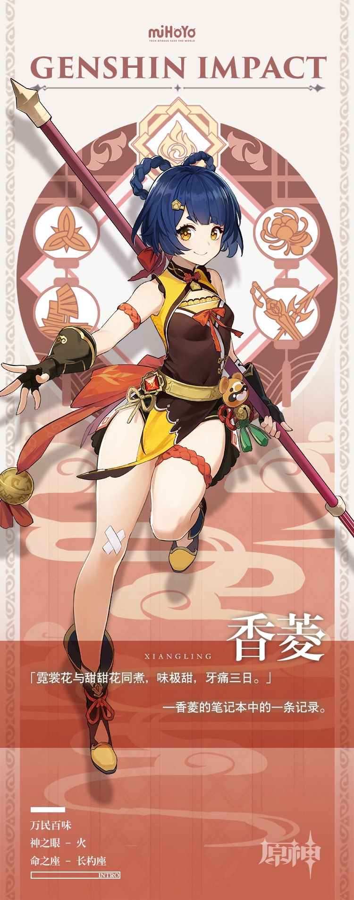

# 堂迎万民，勺起百味。

璃月港两大传统菜系「璃菜」和「月菜」各掌美食界半壁江山，为了一决高下，双方持续争斗，不断发展自己的拥戴者。

然而，不论美味、只争贵贱的「美食之战」直接导致了璃月港内珍稀食材被垄断，引来无数厨师的愤慨。

生在厨师世家，香菱表达愤慨的方式更为直接：她选择接过了自家「万民堂」的大勺。

「美食应该没有贵贱之分才对！」信奉这一原则的香菱不断追寻着料理的新突破。

从冰雾花、史莱姆凝液到怪异虫子、甚至丘丘人的木棍…一切都是她眼中的「可用材料」。

虽说偶尔会做出一些可怕的料理，但香菱从不气馁，因为父亲曾如此教导她：

「做料理有很多秘诀。不过最最重要的秘诀就是，要对料理保持绝对热爱的心。」