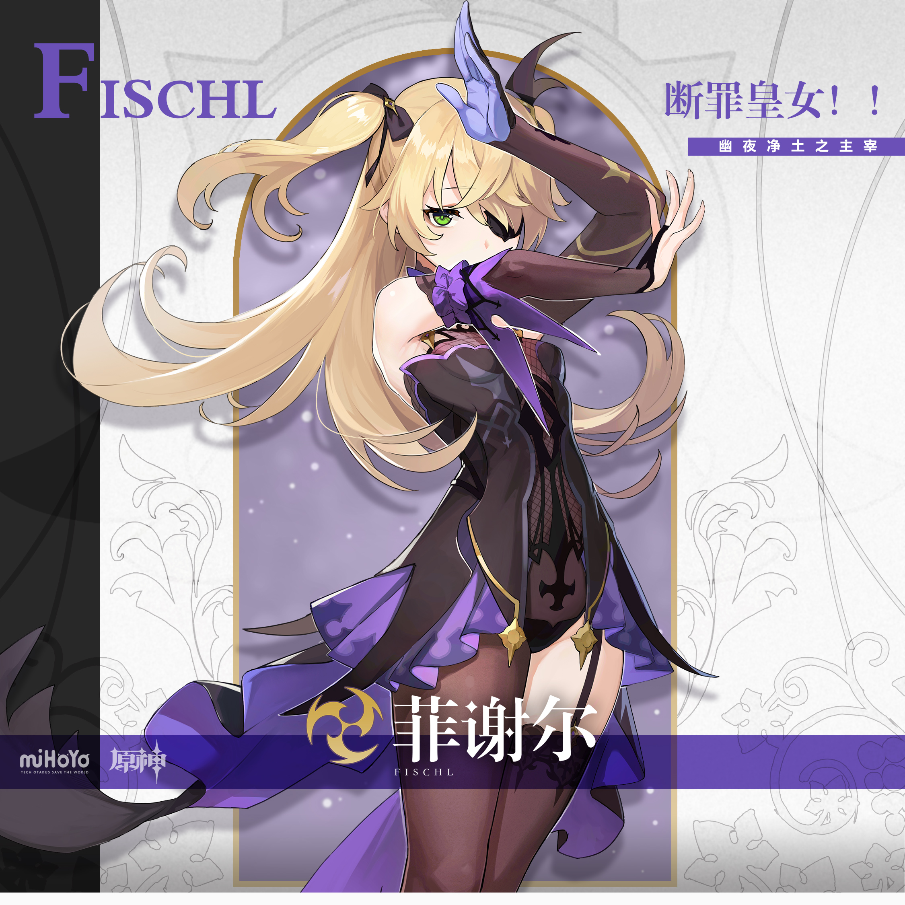
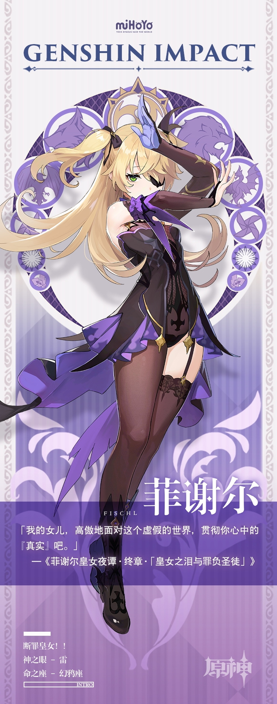

# 断罪皇女，降临此间。

异世界「幽夜净土」的断罪之皇女——菲谢尔，携暗之眷属夜鸦，应命运的召唤，降临于提瓦特大陆。

菲谢尔向每个冒险家协会成员都是这么介绍自己的。

因为能与乌鸦奥兹共享视觉，菲谢尔顺利进入了冒险家协会，成为了一名调查员。

一开始为了听懂菲谢尔所说的话语，协会成员们可是费了不少功夫。好在经过不懈努力，加上奥兹的辛勤翻译，大家最终明白了菲谢尔的语言。

这位举止发言与众不同的调查员侦察迅速，给出的情报也十分准确，这让她渐渐赢得了大家的信赖。

而且菲谢尔为人也很善良。

「奥兹，我之眷属啊...展开遮日挡月之翼，去注视那位厄运缠绕之人吧。」

「遵命，小姐。」

今天的菲谢尔也在用自己的方式关心着冒险家协会的大家呢。