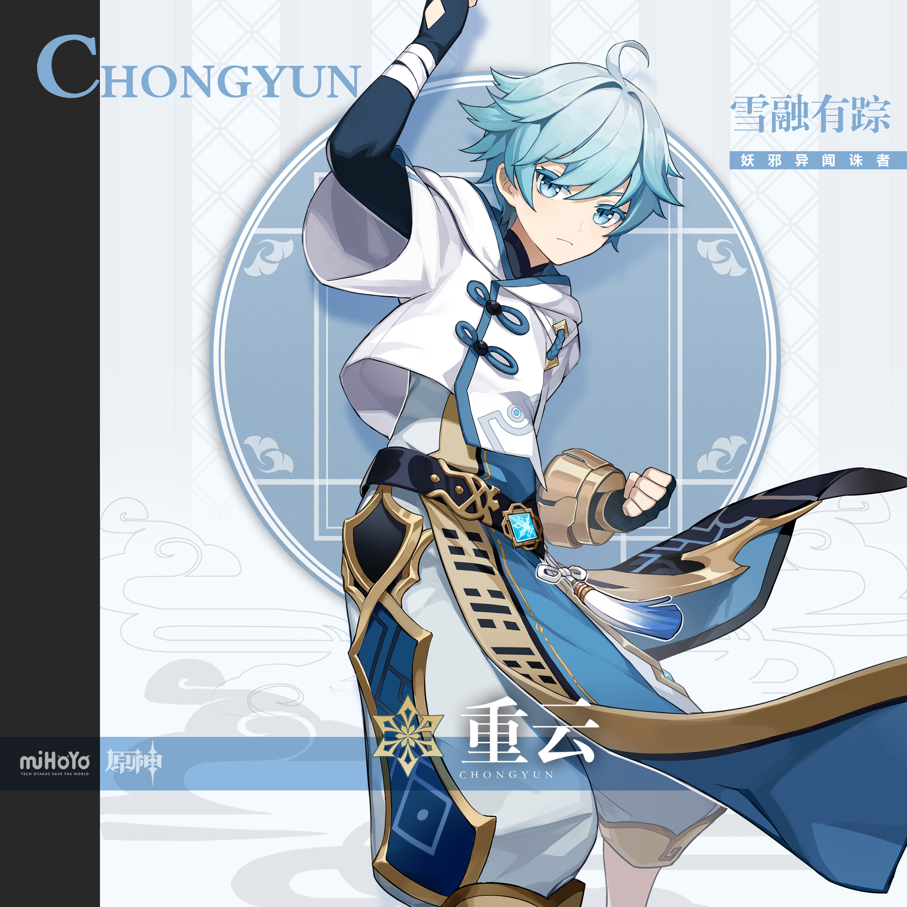
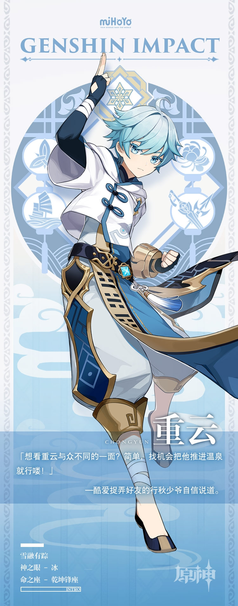

# 赫日清容，霜天玉相。

方士重云以璃月为中心，四处进行驱邪活动。作为驱邪世家继承人，他自幼便有过人的绝技。然而，这种绝技并非学自师门，而是与生俱来的异能——「纯阳之体」。

「纯阳之体」是极为罕见的易热体质，有此体质者，周身阳气流转，稍不注意便会陷入热血冲头的状态。重云深受其害，发作时阳气暴行周身，性情大变，对自身作为一概不知。然而，这一体质也是他走天下的最大资本，每到阴寒之地，原地一坐，就能将妖邪驱逐殆尽。

由此，重云的驱邪路顺畅无比。可惜他本人并不认可这种做法，在作风端正老实的他心中，光凭体质行驱邪之事不过是耍小聪明。若是真正的方士，自当以方术见长。

为与「纯阳之体」抗衡，重云日常起居遵循以下原则：不见烈阳、不喝热水，不吃热食，不沾辛辣，不衣厚裳，不争执，不起怒。他周游各地，试遍天下偏方，仍未能将体内正阳压制分毫。

年轻的方士不由苦恼起来：妖是除了，可长此以往，他要怎么做才能证明自己是一个合格的方士呢？

坐在雪山吃雪馒头的重云思及此时，不由得叹道：往后的路，还长着哪。