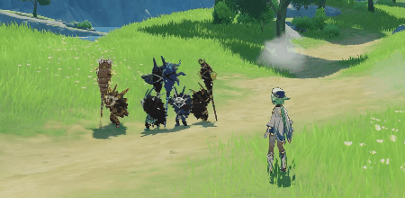
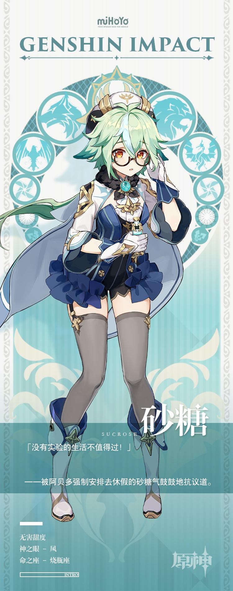

# 生物，就是炼金术的未来！

炼金术士砂糖在「生物炼金」这一领域成就斐然。

在其研究过程…或者，借用她的话：「在追求真理的道路上」，有时也会诞生出各类神秘产物。

能长出六倍种子、起风时让满城人不得不关窗闭门的超级蒲公英，连石砖都能划破的钩钩果，还有…跟南瓜长得差不多大的日落果。

以上这些成果给砂糖带来了巨大疑问，倒也让她的研究大步迈进。

然而，为它们起名字却是更为困难的事。对砂糖而言，比看见实验植株被人摘走或是研究用品被污染还要痛苦。

为一株花蜜浓稠如胶水的甜甜花命名时，时间就像河水一样疯狂地流走了。砂糖用尽心思，花费比为整片试验田人工授粉还长的时间后，总算取出了一个勉强算是名字的东西：

「这是第二十八株…性状…本来学名…」

「就、就叫它…玖式甜甜花改二十八号香味特化版好了！」