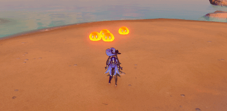
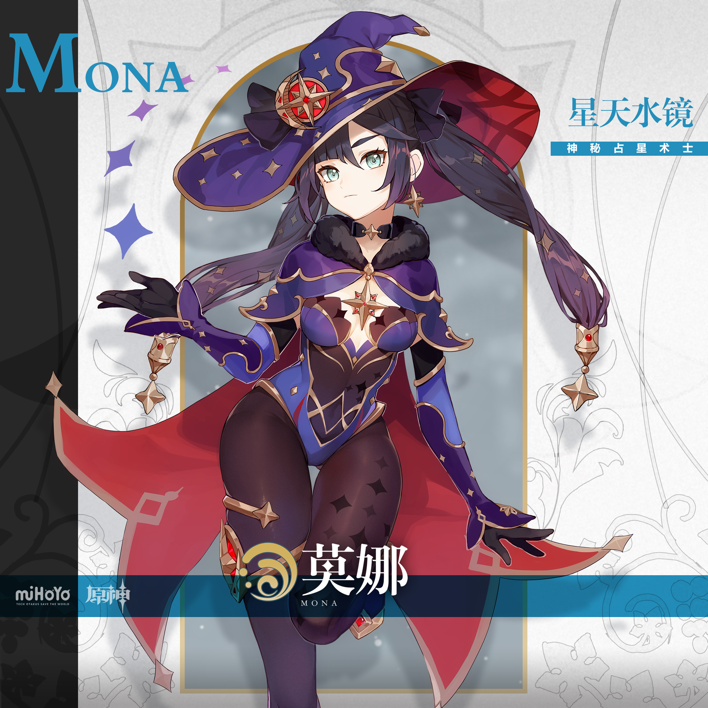
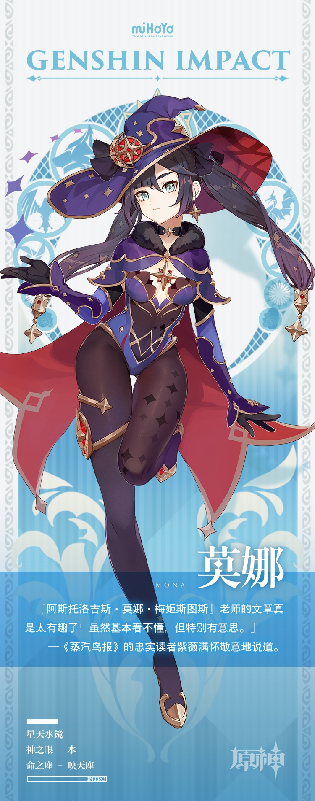

# 繁星闪耀，世人的命运早已注定。

莫娜是一位奇特的占星术士——与其他的占星术士为了赏钱可以信口雌黄不同，莫娜替人占卜向来都是分文不取，但也不会对占卜的结果加以修饰。即便是会让人不悦的结果，她也会直截了当地告诉对方：「就算你加入冒险家协会，也不会出人头地的」、「你和他没机会的，不久之后他就会远走」等等，诸如此类。

她直言不讳的性格导致来找她占卜的人骤减。莫娜对此并无不满，这让她能将更多的时间用在自己的研究上。

既然是研究，那么器具、书籍自然是必不可少的，而莫娜唯一的收入来源是为《蒸汽鸟报》的《星座相谈》专栏供稿。每当稿费到账，她总是会将钱优先用在研究上，璃月的古书、须弥的星盘…每一件都价格不菲，等她回过神时，每月剩下的稿酬勉强只够她满足温饱生活的了。

「没关系，限制物欲是占星术士修行的一部分，只有简朴地生活，才能窥探到世界的真实。」莫娜一边说，一边用咳嗽声掩盖肚子因为饥饿而发出的声响。

今天的莫娜，也在为摩拉发愁。