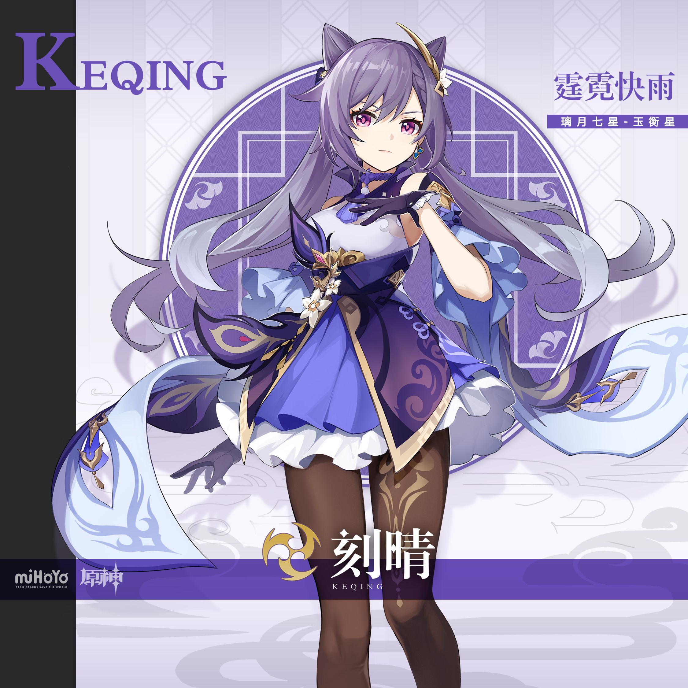

# 霆霓之势，变革之星。

璃月七星之一，玉衡星，刻晴。她对「帝君一言而决的璃月」颇有微词——但实际上，神挺欣赏她这样的人。

身为「璃月七星」，刻晴是个不折不扣的行动派。如果一件事在她看来是有价值、有必要的，那她一定会亲力亲为。比如，她曾亲自踏遍璃月全境，将地势地貌牢记于心，以便日后能够最大限度地利用每一寸土地。

刻晴随时关注着璃月境内的大小事情，岩王帝君每年却只降临一次。

数千年繁华的历史，已经证明追随帝君的脚步是正确之举，但刻晴对此则始终抱有顾虑——眼下璃月港的繁荣，就像沙滩上的宏伟沙堡。决定大海是否涨潮的，却不是人类自己。

「帝君已经守护了璃月千年，但下一个千年，十个千年，一百个千年，也会是如此吗？」

正是这个得不到回答的问题，让刻晴不断努力，丝毫不敢放松。

在旁人看来，这是多余的担忧，但刻晴无法对这一潜在的隐患坐视不理。

这是璃月人未曾设想过的未来…可总有人要走在时代最前沿，亲手开创新的道路。

玉衡星刻晴，自然当仁不让。