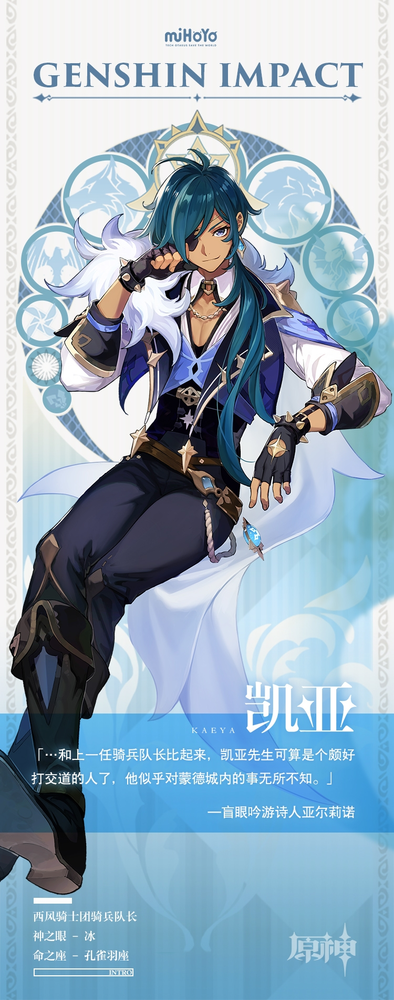

# “倾听人们的烦恼，也是骑士的重要任务。”

**“倾听人们的烦恼，也是骑士的重要任务。”**

===============================

咕咕？今天给大家介绍的是骑士团的骑兵队长——凯亚先生！

在蒙德城中，人人都喜欢凯亚先生。

开酒馆的玛格丽特小姐总被这位骑士的幽默感所逗乐；勇敢的小伙子班尼特对这位无所不知的大哥信赖有加；花店的芙萝拉对凯亚有好感的原因则很简单——因为他的眼睛格外「深邃」。

而在西风骑士团里，作为最受代理团长琴信任的副手，这位新晋骑兵队长完成了一次又一次的任务，从而不断证明着自己的聪明、可靠，以及「不可或缺」。

介绍完毕~咕咕小助手提醒您：现在仍在发放资格的活动是 [>>酒馆漫谈](https://bbs.mihayo.com/ys/article/74607)

旅行者们冲鸭~~~距离原初测试只剩2天啦>w<~