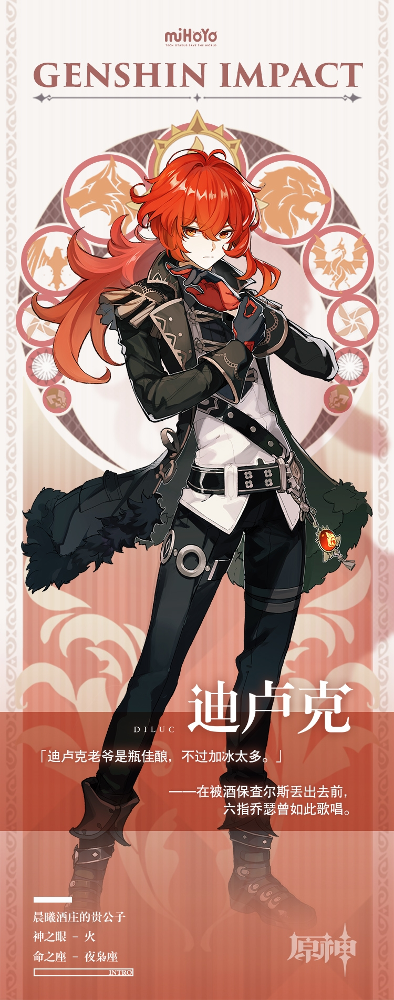

# 我会一直前行，直到黎明到来。

**「迪卢克老爷是瓶佳酿，不过加冰太多。」——在被酒保查尔斯丢出去前，六指乔瑟曾如此歌唱。**

 

**在蒙德城，人们热爱酒。**

**一天辛劳后，一杯美酒是最好的犒赏…但当美酒入喉，遍地都是再喝下一杯的理由…**

**但是，作为蒙德最大酒庄「晨曦酒庄」的庄主，迪卢克老爷却总是滴酒不沾。**

**当有人向他问询，得到的回答却永远是一抹礼貌又神秘的微笑。**

**================================**

 

迪卢克老爷好帅呀咕！！（花痴脸）

老爷的酒庄里还缺快报员吗？从来不咕的那种。

工资是无限续杯的蒲公英酒就够了！

有机会的话，咱一定要去「天使的馈赠」尝一尝蒲公英酒。

如果喝醉了……咕~！

不过现在快报员暂时还不能去拜访迪卢克老爷的酒馆，咱还得工作呢~

那我们下次再见啦~咕~

现在社区中还有讨论活动进行中，参与就有机会获得实物周边奖励噢咕！

[>>>戳我参与活动<<<](https://bbs.mihayo.com/ys/article/194513?create=1)