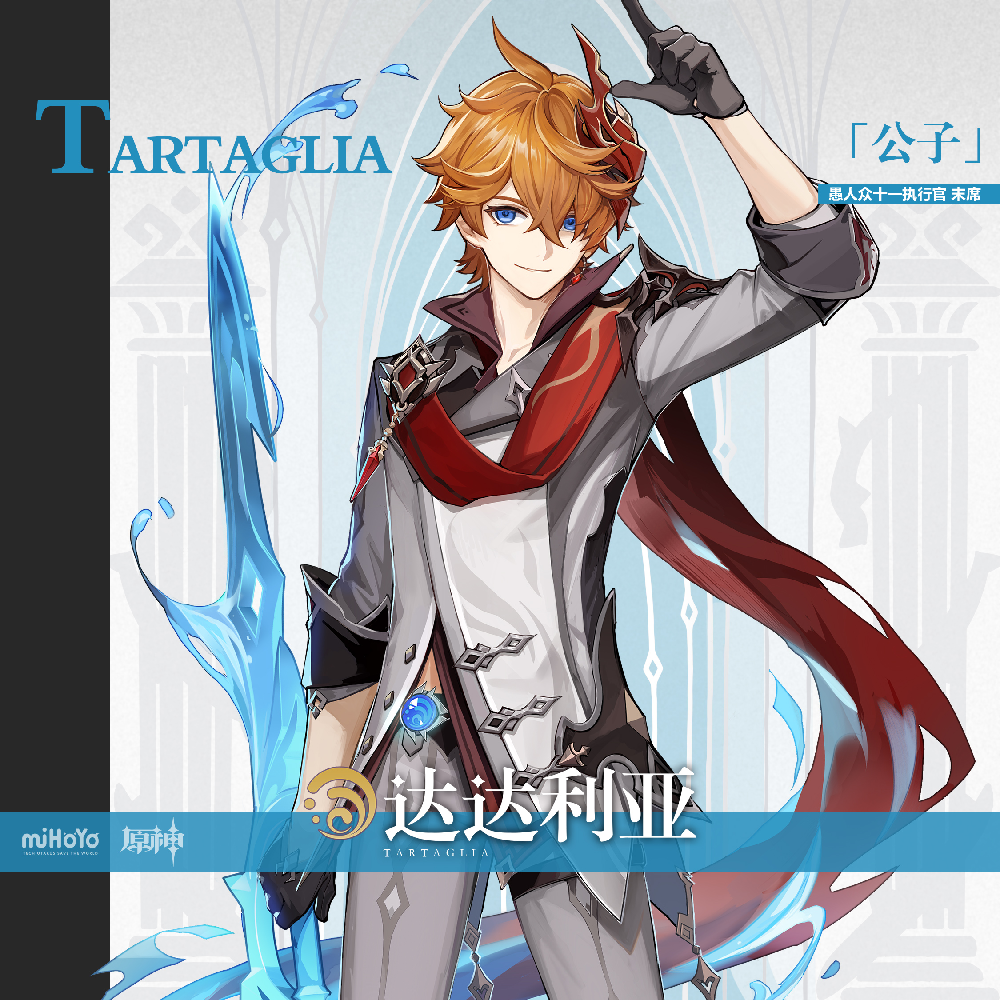
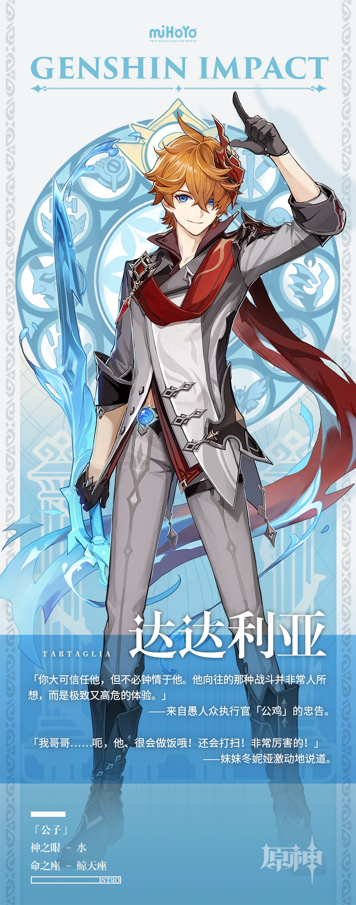

# 「公子」· 达达利亚—秘密，自极冬而来。

温暖的朋友、无情的杀手…因其身份立场多变又叵测，人们很难找到一个精准的名字来称呼他。但在某些私密时刻，他会卸去所有头衔，卸去沾满阴谋的外壳，成为自己。 

他的名字是达达利亚，一个忠情战斗、忠实于身体感受的追逐者。

不必猜测他的想法，也无需质疑他的来意。只要记住：这幅稚气未脱的外表下暗藏的，是锤炼到极致的战士之躯。

这样的他，犹如一柄被天鹅绒包裹的白银利刃，不详、叵测，令人警惕。