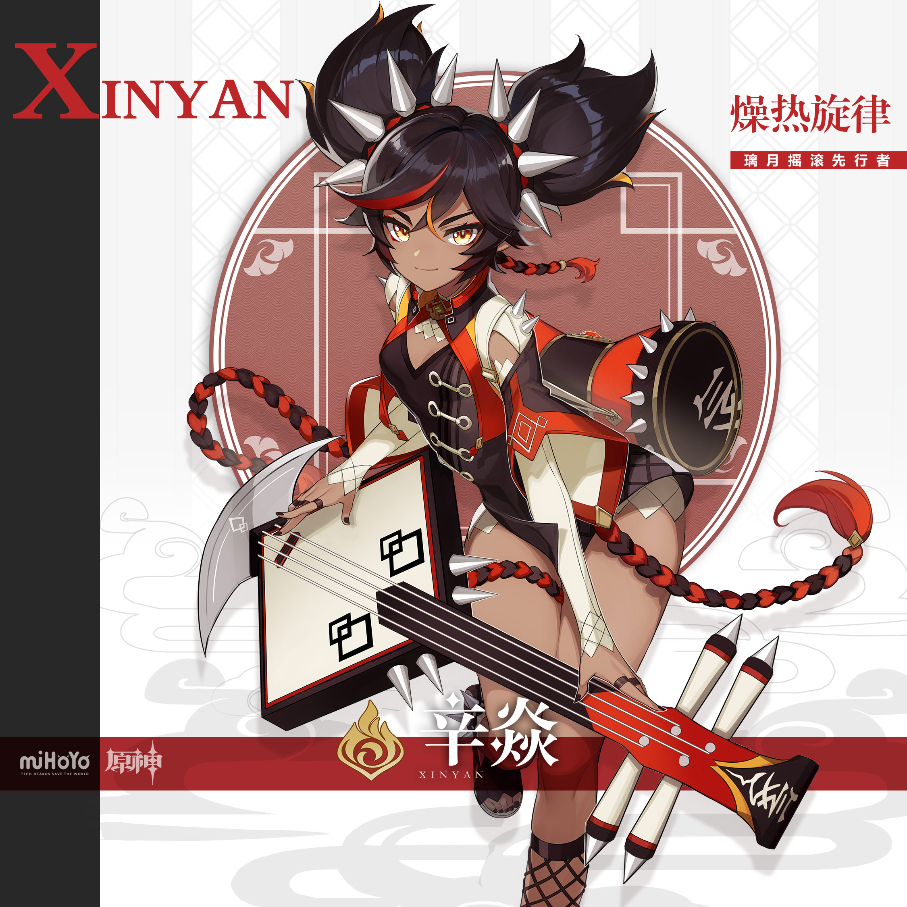
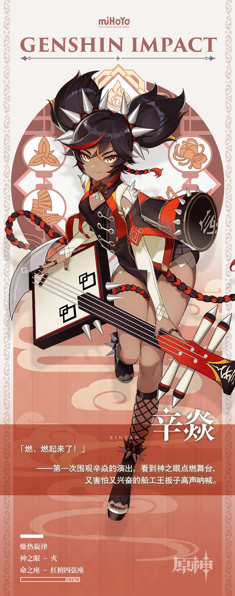

# 「燥热旋律」辛焱—摇滚时间到！

去看看吧，追寻璃月夜晚的火光，聆听最劲爆的节奏，加入盛大的忘我演出——

那是一场对璃月传统的反叛，辛焱以琴为剑，以火为号，誓要将漆黑染成白昼。

而在颓废狂躁，又如梦似幻的烟尘之后，皎月高悬，街头巷尾只剩醉客嘴里意犹未尽的余韵，

以及想要抓捕辛焱的千岩军的叫喊，罪名是「违反消防安全规定」。

但其实除了临时舞台以外，什么都没有烧掉。少女早就在火焰中背朝人群挥了挥手，带走了乐器与摇滚，留下了一地尘嚣。

可她不愿被人追寻，正如她片刻之前纵情歌唱的那样：

「看壶的老太问我哪儿去留。我说玉京台的花，群玉阁的渣。吃虎岩的灯，码头上的狗。

除非夜叉、鬼差扣下我的魂，不然还往人海里走！」