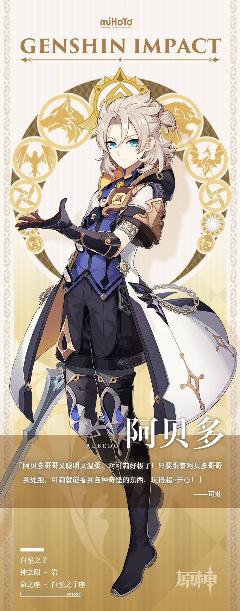

# 「白垩之子」·阿贝多—无垢之土，创生原初之人

在炼金术方上造诣极深，却不轻易说出事物的本质。

穿行在对真理一知半解的「凡人」间，示其以恰到好处的真诚与和善。

彬彬有礼，气质高雅。表面上疏于交际，其实并不吝于伸出援助之手。

如果认可你这位朋友，即便相识不久，他也会在百忙之中抽时间为你绘制精美的肖像画。

西风骑士团首席炼金术士阿贝多，正是这样一位神奇少年。从蒙德居民到骑士团成员，无不为他的学识所折服。

「天才」、「白垩之子」或「调查队长」…他不怎么在意称号和名望，只专注于研究课题。

财富和人脉不是他的目标。他渴望驾驭的，是从古到今深藏于人类头脑中的无上知识。