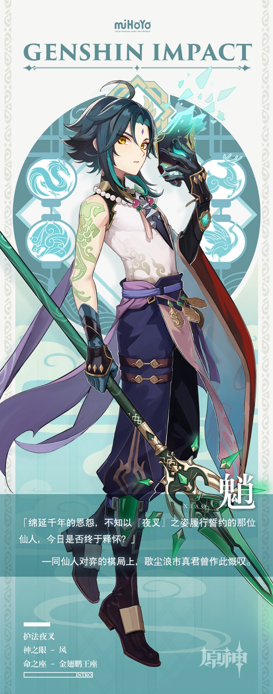

# 护法夜叉·魈—为君守护，靖妖降魔。

「绵延千年的恩怨，不知以『夜叉』之姿履行誓约的那位仙人，今日是否终于释怀？」——同仙人对弈的棋局上，歌尘浪市真君曾作此慨叹。

在璃月港住民心中，居于「绝云间」的「三眼五显仙人」，皆有极高名望。

每逢佳节吉日，人们都会上香祷告，祈望仙人保佑。

但人们不会对魈祈祷。

因为魈并不是能带来祥瑞、富贵的福星，而是与妖邪死斗的「夜叉」。

在璃月港千家万户通明的灯火后，这些战斗既无尽头，也无胜者。无人见证，也无人感激。

魈并不在意，因为他是璃月的护法夜叉，守护璃月是他必须履行的「契约」。

也只是如此而已。