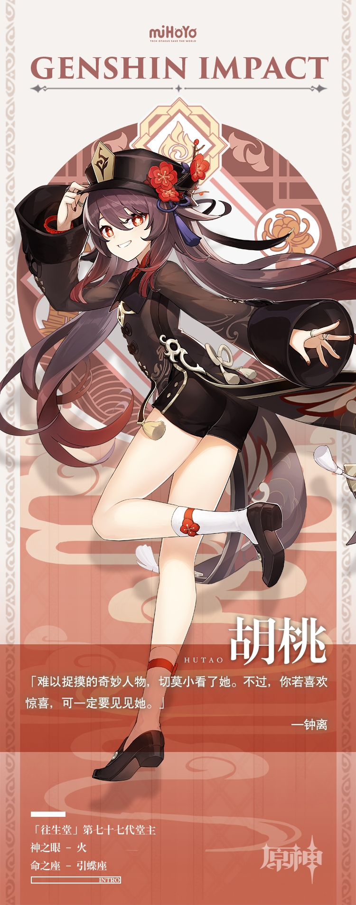

# 小心了，胡桃来啦！

单看外形似乎只是个古灵精怪的快乐少女，谁能想到她就是的大名鼎鼎的传说级人物——胡桃。

既是「往生堂」堂主，也是璃月「著名」诗人，胡桃的每一重身份都堪称奇妙。她总是飞快地出现又消失，犹如闪电与火花并行，甫一现身便点燃一切。

她午夜写诗，白日奔走，漫游山海，俯仰自得。不仅如此，更会出现在任何时间任何地点。街头巷尾、荒山野岭，明朗晴天、昏黑夜晚…万事万物都有可能，万物万事皆可成为她的奇思妙想。

胡桃是一个人们永不能参透的谜语，但没人会为不能解读她而沮丧。若被问起，他们便说：那是理所当然的吧？毕竟，谁都跑不过风，也抓不住火焰的尾巴呀！

行走在生死的分隔线上，背负着不为人知的职责。清新如春风也温暖如夏日，偶尔，也会肃穆如秋叶，凛冽如寒冬。

小心那个胡桃！否则，一不小心就会被她牵着鼻子走喽！