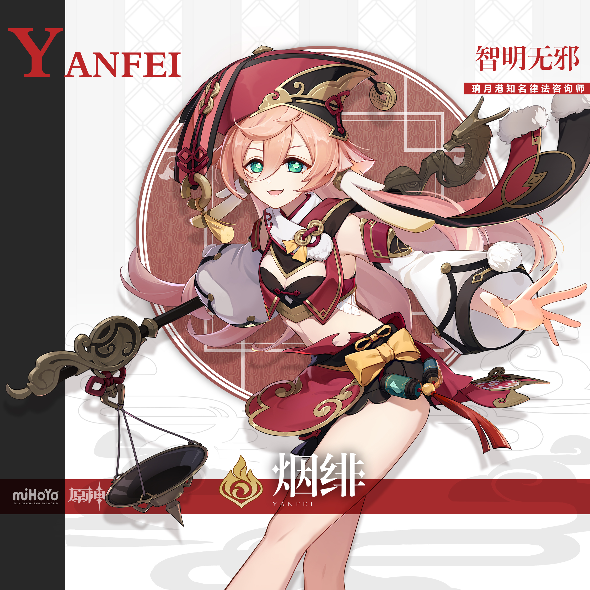
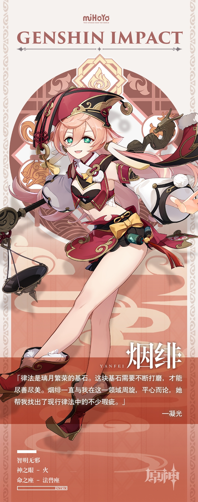

# 「智明无邪」·烟绯：不期修古，不法常可

璃月港最优秀的律法咨询师——烟绯，传说她将上万条法典条文熟记于心，能因时因地巧用律法，妥善处理每一起委托。

话虽如此，烟绯绝非墨守成规之辈。在法律与情理允许的范畴内「灵活变通」，才是她的作风。

身负半仙之血的烟绯，会以这种独特又有效的方式守护璃月港的「秩序」。

无论是商人还是民众，只要生活在璃月港，多少都听说过烟绯的大名。当然了，按照契约之城的老规矩，想请烟绯接受案件委托或提供咨询，得准备一笔不菲的佣金。