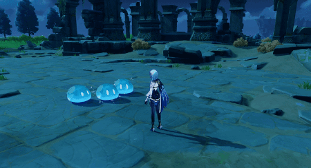
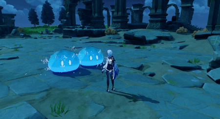
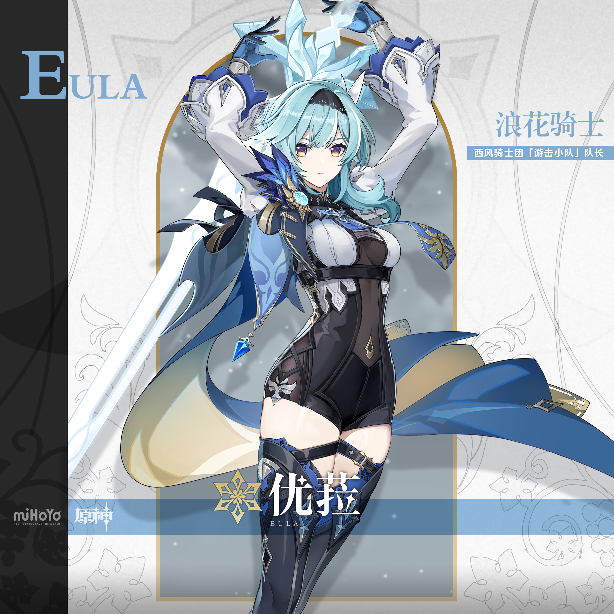
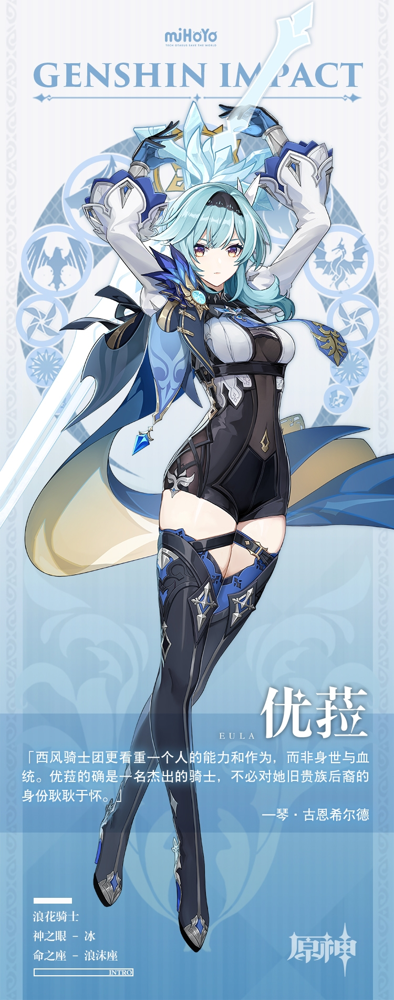

# 「浪沫的旋舞」·优菈——于旋舞之时，斩断罪人的枷锁

​      作为西风骑士团「游击小队」的队长与声名显赫的「浪花骑士」，优菈长期率部在外巡逻，斩获过诸多功勋。驻扎在高山深涧中的骑士们时常成为魔物的突袭目标，优菈能用最为迅速的支援排除险情，化解危机，她也屡次率队主动进攻，捣毁深渊教团的据点，将阴谋扼杀于萌芽状态。

​	可优菈的身世尤为特殊，诸多矛盾盘根错节——她是劳伦斯家族的末裔，被蒙德民众视为罪人之血的具象。这样的她却在多年前与家族决裂，加入了西风骑士团。碍于难以消除的偏见，优菈并未得到公正的对待。在蒙德民众眼里，她始终是「外人」，甚至——「危险人物」。

​	多年来的经历促使优菈塑起无形之盾，保护自己免受无妄之灾。「复仇」一词，或许是这面盾牌最为外显的一角。唯有抛去流言蜚语，试着接受她待人处世的逻辑，才能认识到这位少女复杂外壳下的原貌吧。