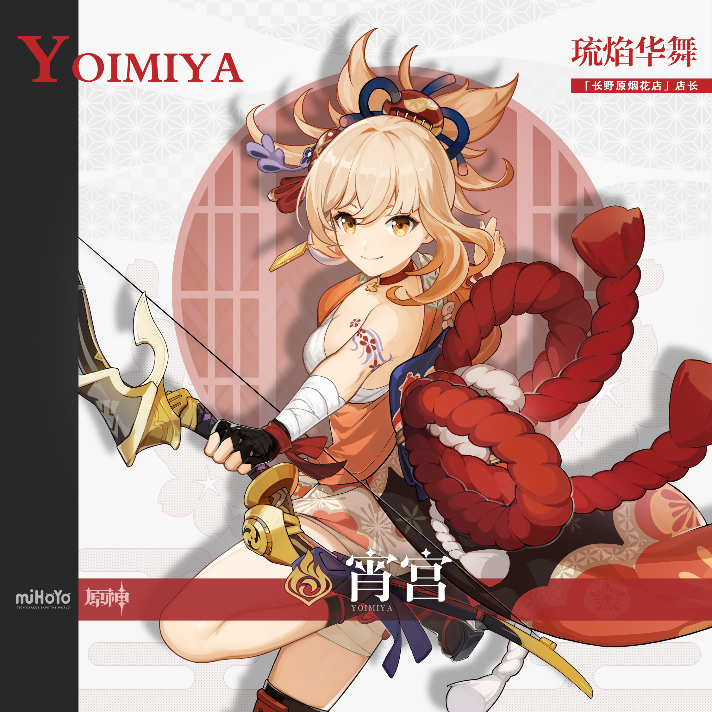
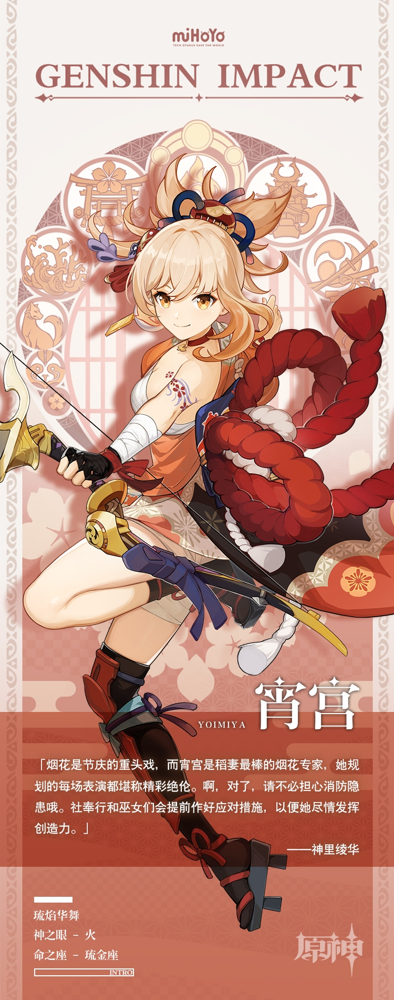

# 「庆典开场，烟花绽放！」

才华横溢的烟花工匠。「长野原烟花店」现任店主，被誉为「夏祭的女王」，在稻妻城内可谓是家喻户晓。

稻妻城每年举办的各式庆典都会用到宵宫精心制作的烟花，她有着焰火般旺盛的创造力，总能为人们带来无与伦比的惊喜。

宵宫童心未泯，时常与孩子们一同玩些简单又不失趣味的小游戏，或是陪他们一起去找亮晶晶的小玩意儿。孩童的纯粹让她感到无比快乐。

她也热衷于社交，总是抓住一切机会与人攀谈，似乎有着无尽的逸闻和想法亟待分享。

原则与匠心，是宵宫最为珍重之物——烟花虽然转瞬即逝，绚烂的光影却能永远留存于人们心中。

既是一瞬，也是永恒。这份短暂的奇迹，便是她给予周围人的「守护」。

「正是因为有大家的寄托，烟花才能以如此美妙的姿态一直存在下去吧。」