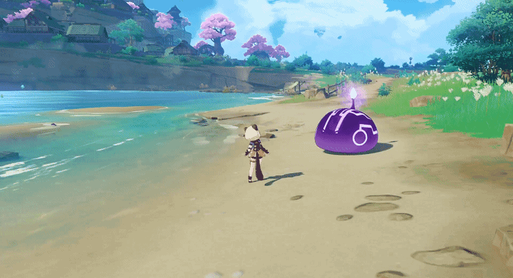
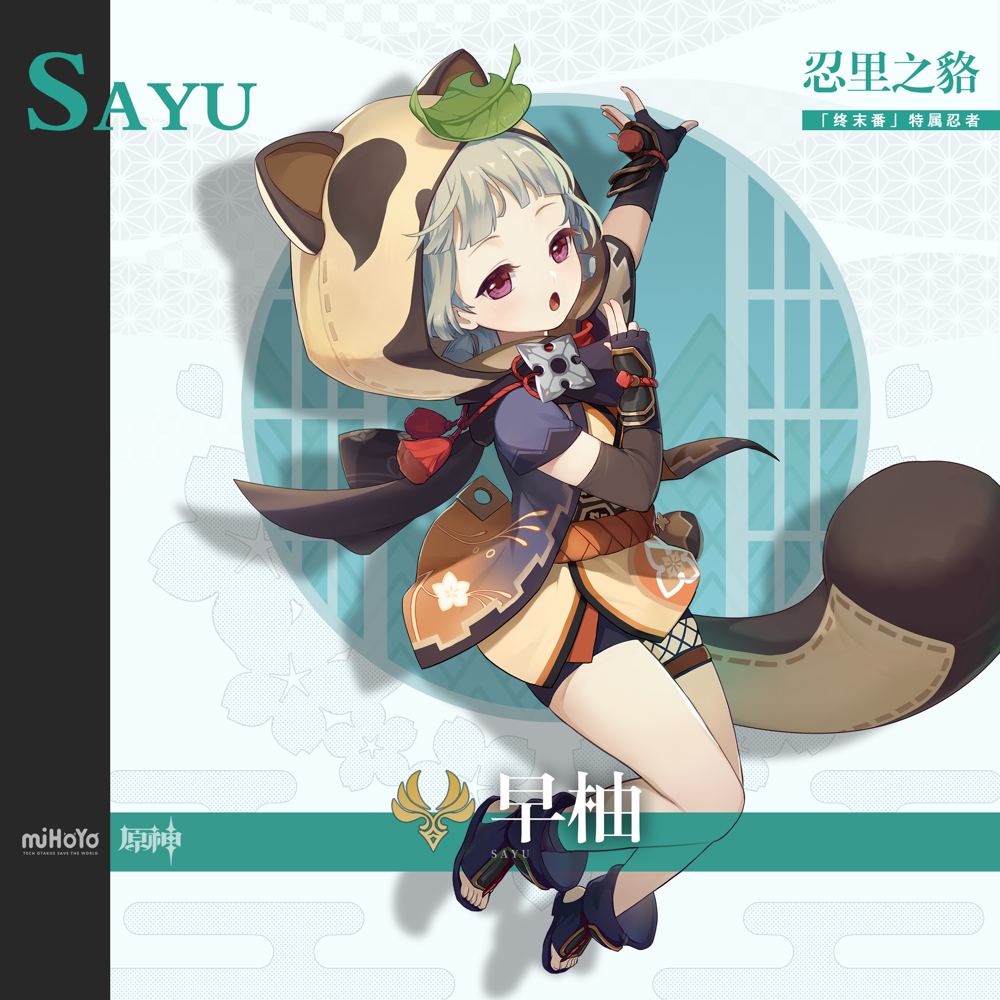
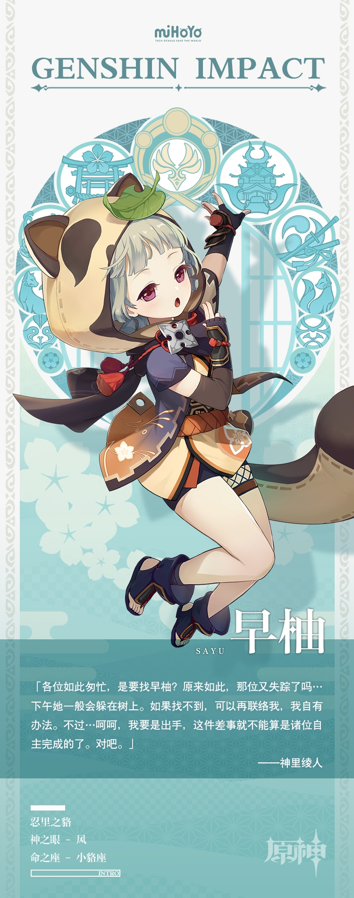

# 一梦作伴，万野无踪。

隶属于「终末番」的忍者。个子小小的，行动非常敏捷。

说到身高啊…早柚停止长高已经很久了，久到她觉得自己落入了一个时间停止的梦。

「什么时候才能长个子呢？是我睡得还不够吗？」

偶尔醒来的小忍者这样想着，又一头扎进梦乡里。

早柚坚持认为睡眠可以补充能量，能量够了就能长高。为完成这一执念，她想尽办法偷懒，把忍术修炼得炉火纯青。

逃跑、匿踪、变幻…无论哪一方面，早柚都堪称大师。一片树叶，一个水桶，有时可以有别的名字，例如：早柚。

因此，若是「终末番」有需要早柚出马的工作，总要大费周章先找到她。

当然从早柚自己的角度看，这不叫偷懒，只是把时间花在了睡觉长高之类更有意义的事情上。