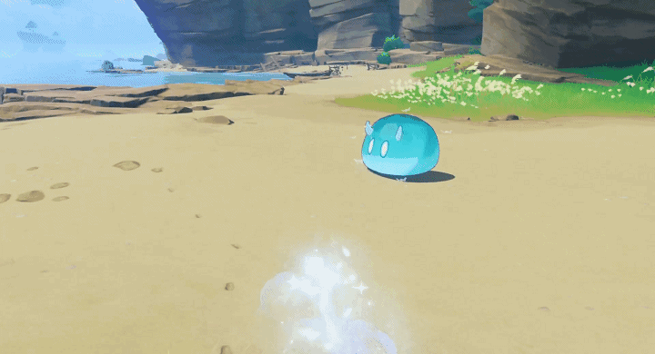
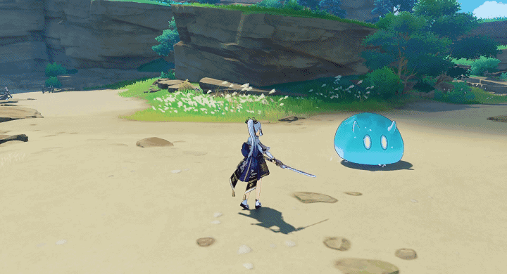
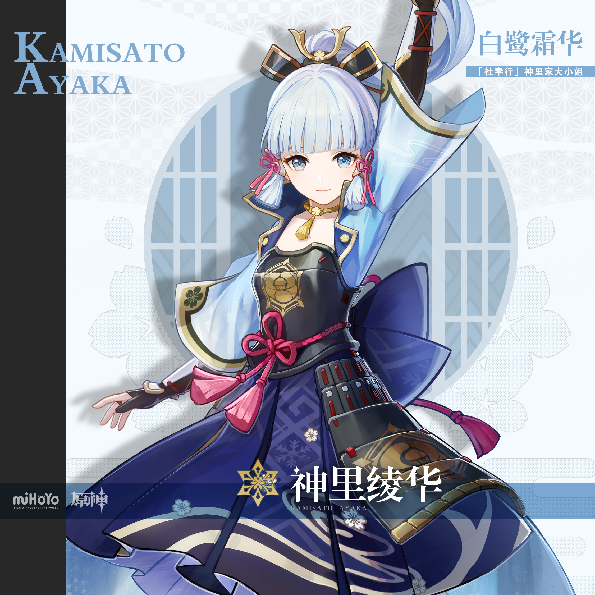
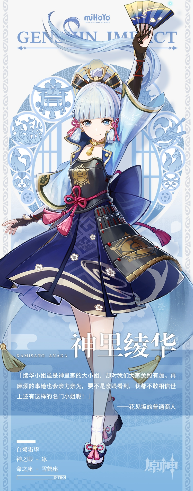

# 如霜凝华，如鹭在庭

稻妻「社奉行」神里家的大小姐。容姿端丽，品行高洁。

与出任家主的哥哥神里绫人一同打点家族，兄妹分工，哥哥掌管政务，妹妹则主理家族内外事宜。

绫华性情善良仁厚，待人礼貌得体，常亲自出面处理民间事务，与民众距离很近。她个性认真，追求将每一件事务都办得尽善尽美。人们为这份心意所感动，亲近于她，还赠予她「白鹭公主」的雅称。街坊邻里说起她，总会露出真心实意的赞叹之色。

受良好家教影响的绫华有着一颗纯如冰晶的至美之心。冬日里旋转冰晶，便能看到折射出的绚烂华彩。绫华的心灵亦是如此。她不只拥有华美拘谨的一面，心灵深处还埋藏着不为人知的温柔与可爱。

不过，想转动高悬于天穹的心，就得有攀上云端的能力。对那般能人异士，绫华可是非常愿意与之结交的——因为良友于她，有如霜尖点翠，剑上流光，将是极富命运感的一笔点缀。