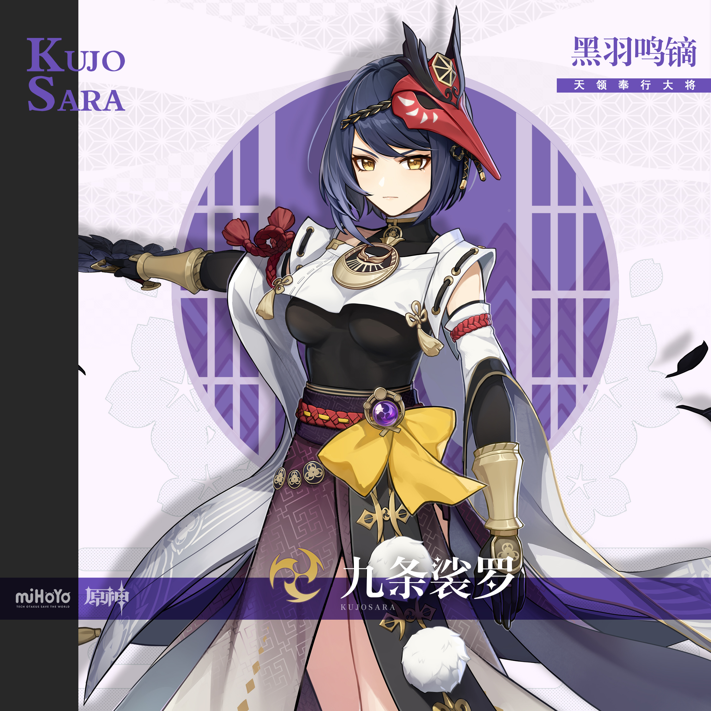
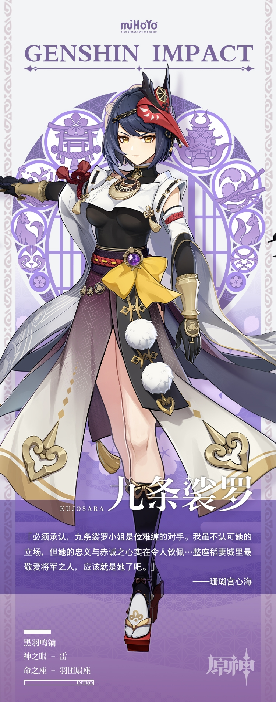

# 迅雷烈风，飞光万顷

天领奉行现役大将。杀伐果断，骁勇善战。

若说将军大人是高天之上的鸣雷，九条裟罗便是难以防备的闪电。闪电先行，尔后必有骇人雷鸣。

身为九条家的养子，她向来以官方态度对外。「雷厉风行」、「不苟言笑」……人们对九条裟罗的印象大抵如此。

然而，这位背负着臣子职责，以忠义为己任的战将并非外表所见那般冷漠，而是决意要让自身好恶悲喜为大义让步，才亲手选择了割舍一部分心灵。

对她而言，辅助将军大人实现「永恒」才是最首要的。纵使知道终点不会有自己的身影，也在所不惜。

——胜利将会属于我们所有人，哪怕战场上最后剩下的不是我也好。

假如人只能有一个愿望，这便是九条裟罗的「愿望」。

藏在她冷峻外表下的，是一颗炽热如暗火、跃动如幽雷的心。