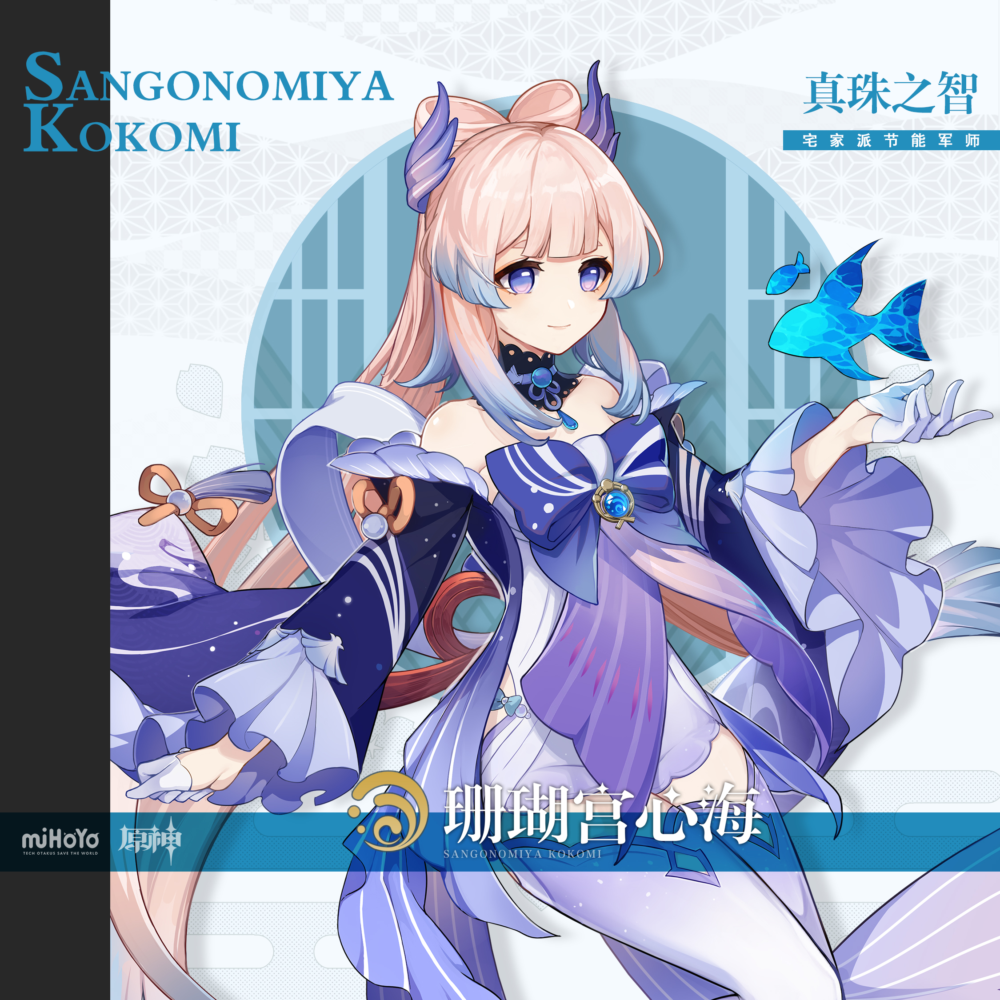
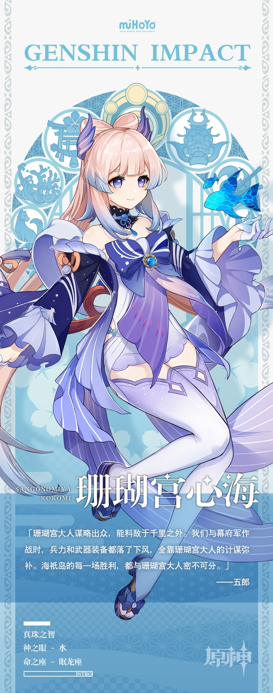

# 奇策百计，决胜千里

海祇岛的「现人神巫女」，即——海祇岛最高领袖。

人们普遍认为珊瑚宫心海是一名足智多谋、深不可测的领导者。因为她脸上总是带着恬静的笑容，谈笑间将所有事务安排得井井有条。

心海自幼通读各国兵书，军略才能出色，擅以奇策算计对手。海祇岛在人力物力上都不占优势，多亏心海布置的各种战术，才能多次转危为安。而在内政、商业、外交、监察等各个领域，心海也会尽自己所能做到最好。这些功绩令她深受海祇岛各方势力的信赖。

「放心，有珊瑚宫大人在」，这句话也成为了海祇岛民众时常挂在嘴边的话语。

但其实，很少有人知道心海从前最大的梦想不过是做一个隐于幕后的军师。对她来说，与人聊天是极度消耗能量的事，每次演讲会不自觉地手抖，面对繁重的工作也会有退缩的念头。每天她最快乐的事情，就是完成工作后宅在家里，捧一本心仪的兵书独自研究。

年少登高位，对许多人而言都是莫大的幸运。可对心海来说，越在高处，越是如履薄冰。