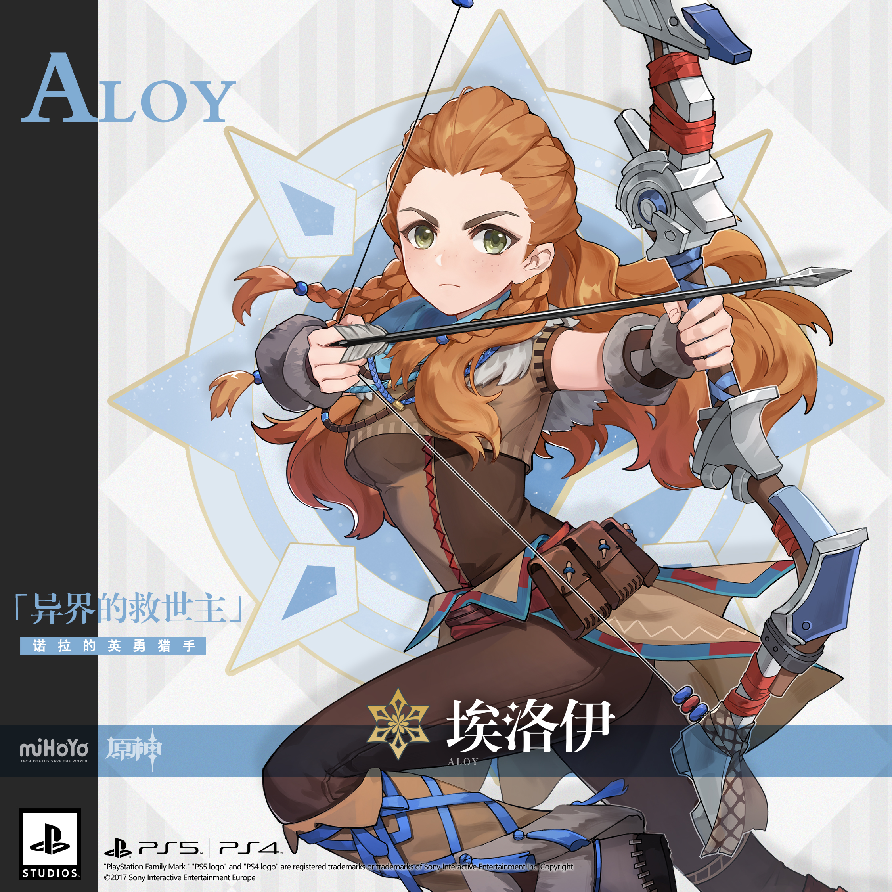
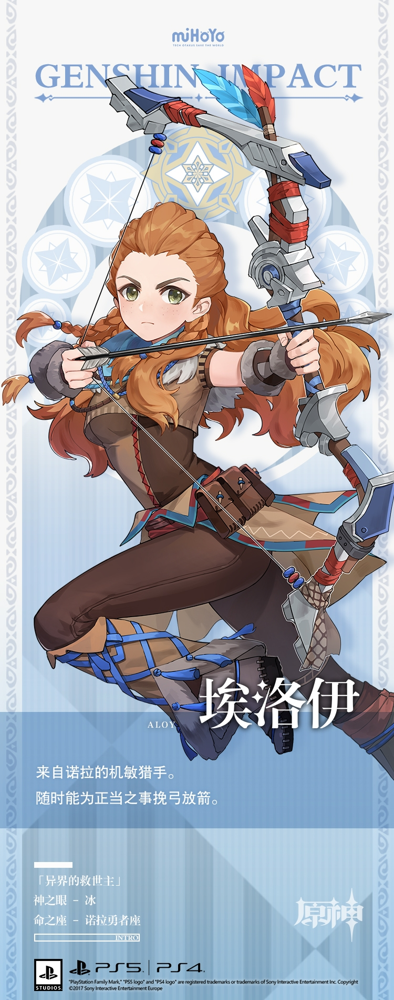

# 只有最险峻的山野，才能磨炼出最优秀的猎手。

流放者——这是埃洛伊最先拥有的身份。

自出生起，埃洛伊就一直受到部落中不知缘由的排斥和畏避，被迫居住在远离部落的险峻山野中，由一名猎手罗斯特抚养成人。

但她为什么会被部落排斥？她的身世究竟是什么？

这些疑问始终困扰着埃洛伊。为了找到答案，埃洛伊曾刻苦训练，期望在取得「试炼仪式」的胜利后，再从部落族长口中问出些讯息。但当试炼的时刻来临，迎接她的却是一场突如其来的灾难。厄运从她身旁夺走了所爱之人。

顽强的埃洛伊并未退缩。相反，她坚定地踏上了追寻之旅。

她走遍了覆满尘雪的荒野，追猎着如山般庞大的机械巨兽，与神秘的部落艰难交涉，探寻诸多远古遗迹…在这趟旅途中，她逐渐得以窥见自身命运，心中的诸多疑问终于获得解答。

最终，埃洛伊和她的盟友见到了真正的敌人——「哈迪斯」，击败了那份来自远古的恶意，挽救了世界。

她曾想过，也许那会是旅途的终点。但命运之路永远比人们想的更长，她寻着新的方向踏上了提瓦特大陆。

在这全新的世界中，猎手埃洛伊已经蓄势待发，准备好迎接各种前所未见的挑战了。

「埃洛伊，加入狩猎。」