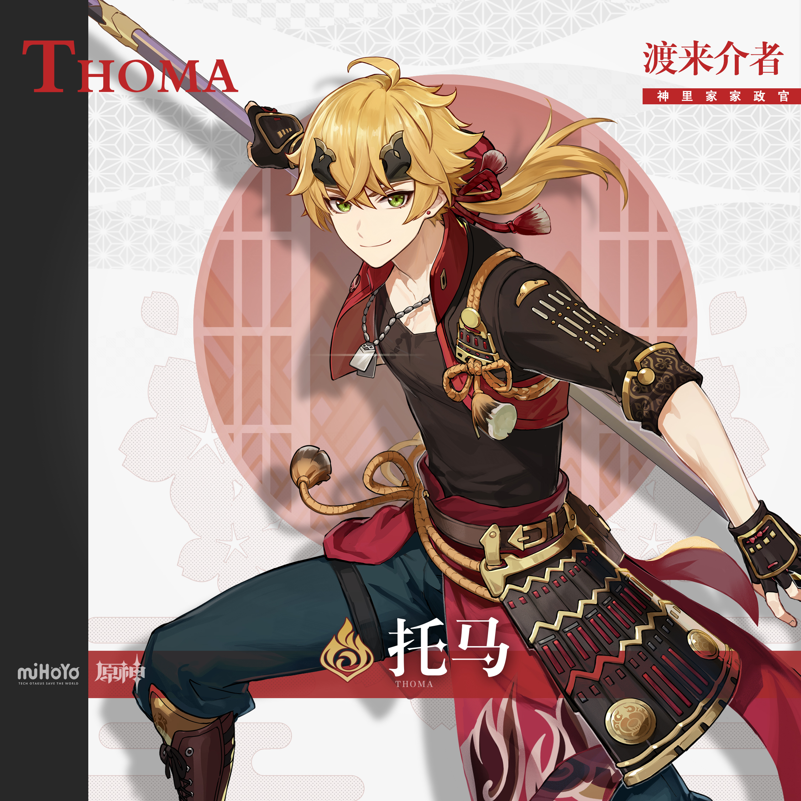
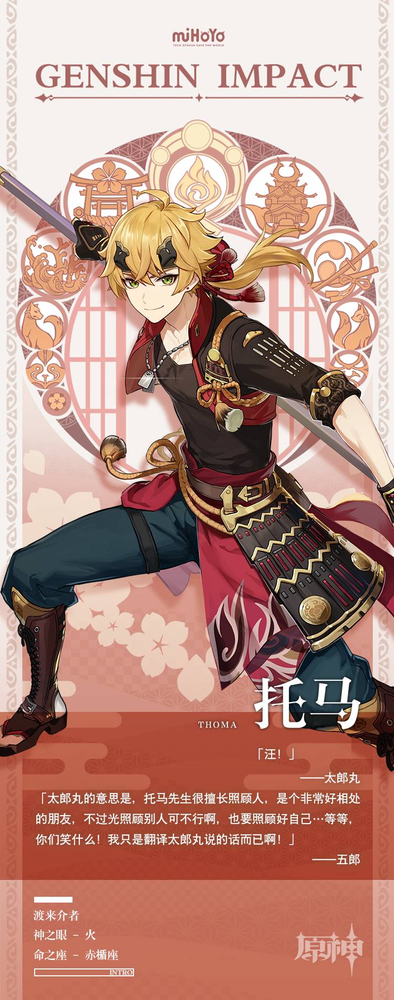

# 渡来介者，赤袖丹心

蒙德出身的托马现居稻妻，他既是社奉行神里家的家政官，也是活跃在稻妻的「地头蛇」。

也许是受故乡轻松快乐的氛围影响，托马很擅长社交。虽说是外国人，却在稻妻本地建立了意想不到的强大人际网。

天生富有亲和力的他总能轻易融入各种话题，与各种人群建立往来。该维护社奉行的权益时，他也会收起笑容，切换出认真的那一面。

不过偶尔，托马会独坐在社奉行府一角，思考有关自己的事。

待人接物细心友好，关爱一切动物与同僚的他，或许也有着不可言说的乡愁吧。