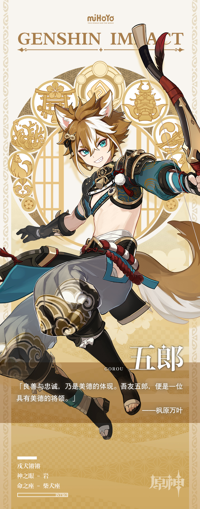

# 锵锵领兵行

忠勇双全的海祇军大将。天生具有野兽般的战斗直觉与顽强意志，能精准找出绝境中的胜机。领导着军备、物资皆不占优的海祇军与幕府军分庭抗礼，力求为活在这片土地上的人们支撑起一片生存之壁。 

外人或许很难想象，战场上有着万夫莫开之姿的五郎，私下却像个知心哥哥，能与每位部下相处融洽。

在五郎眼中，身边的人既是勇猛作战的兵士，也是自己认可的亲近伙伴，是自己必须守护的珍贵宝物。脚下的土地、重要的伙伴、高尚的信念…他的「忠」与「勇」，正是为这些宝贵的人事物而存在。

藏在五郎身躯之中的，是如大地般广袤坚实的灵魂。