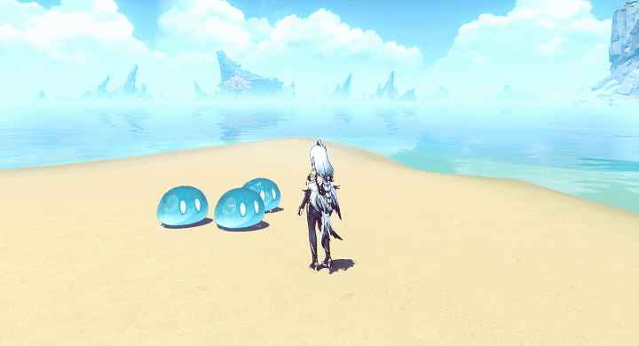
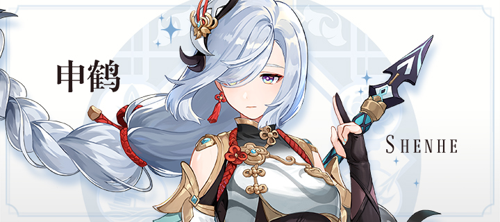
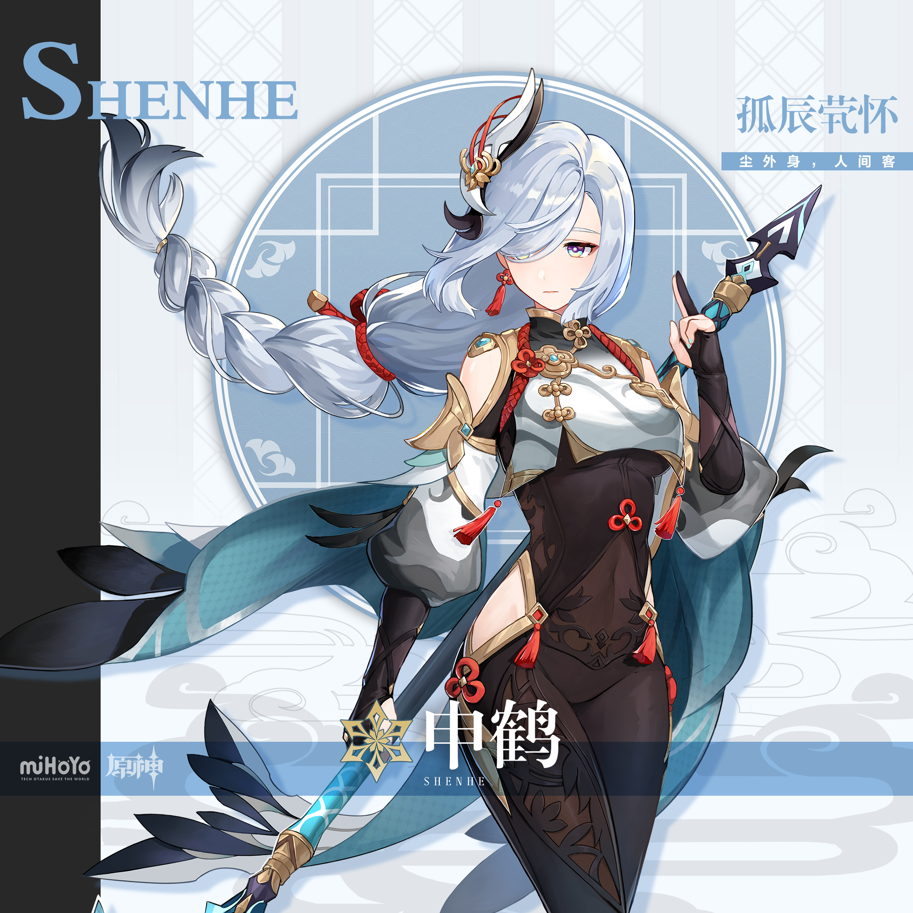
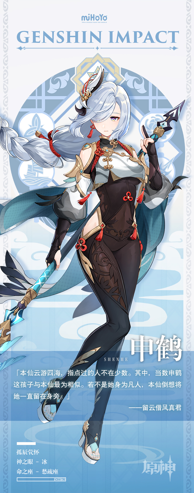

# 红尘渺渺，因果烟消

申鹤本是驱魔世家旁系之子，出于一些原因被留云借风真君收养。

对申鹤来说，留云借风真君是一位博学健谈的师父。

对留云借风真君来说，申鹤也是她指点过的人类中最特别的那个。

以人类之身与仙家一同生活并非易事，但申鹤体质特殊、意志过人，又极有仙术天赋，很受众仙家认可。不过，长年累月修行加上吃仙草、饮山露的生活习惯，让她离人间的生活越发遥远，甚至被当成过神秘的白发仙人。

性格中偶然流露出的锋芒与身上绑缚的红绳，也为她的「神秘」再添一笔。若把她的过去写成故事，想必会有多个版本。

天上仙女也好，白发魔头也罢，人们将如何看待这个神秘的女子？而掩藏在她身上的秘密与真心，也如山间云雾一般难以捕捉。