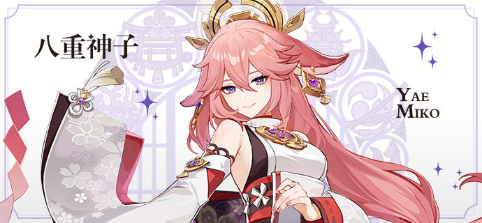
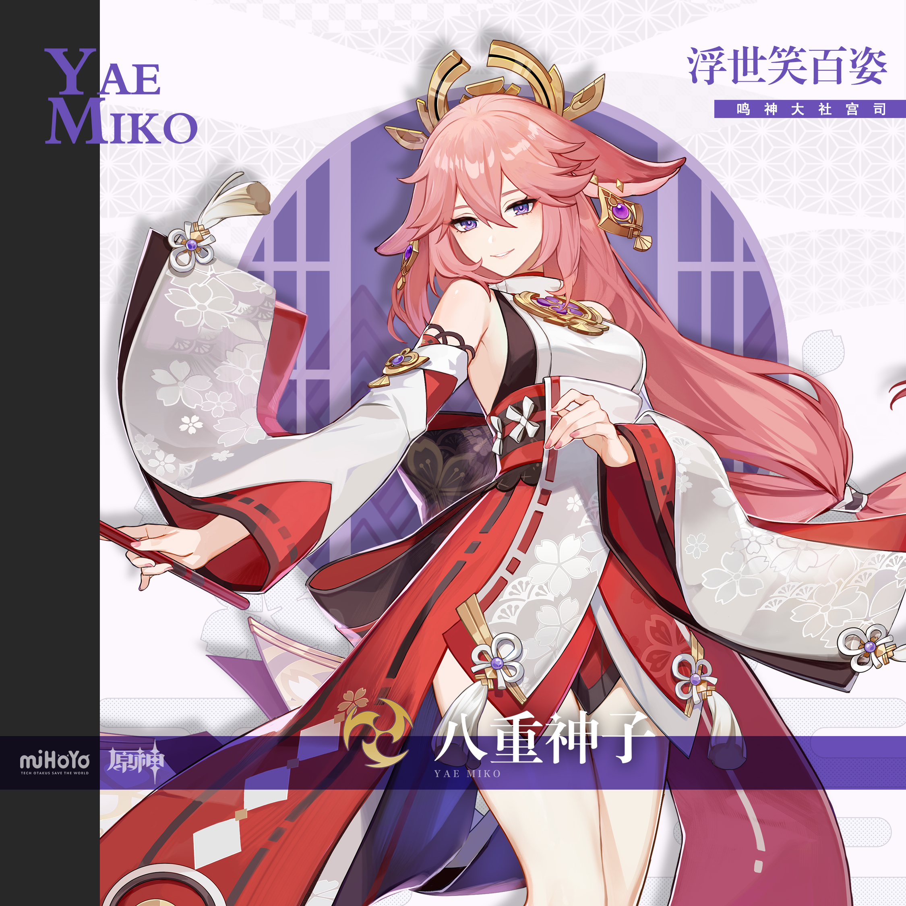
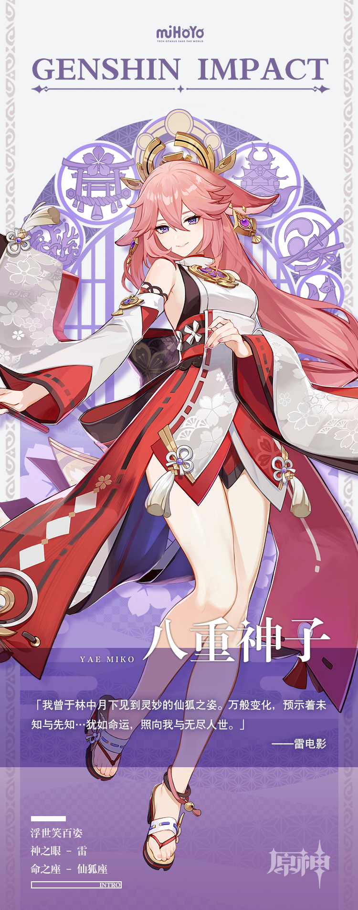

# 暴恶嗤笑之悯相

鸣神大社的大巫女、狐之血脉的延续者、「永恒」的眷属与友人…以及，轻小说出版社「八重堂」的恐怖总编。

不必追寻其中任何一面。每一面都是八重神子，每一面却也无法成为真正的她。

各种姿态，都犹如镜子的碎片，映射出截然不同的她。因诸多身份包裹，她亦成为了一块被无数面御镜包围的宝钻。

上百种面相，严肃或快活，悲悯或漠然。

无人知晓真实，就像无人能轻易从秘林中找到一只与过客擦肩的仙狐。

可若是狐狸注视着人…狐狸又将往何处去？