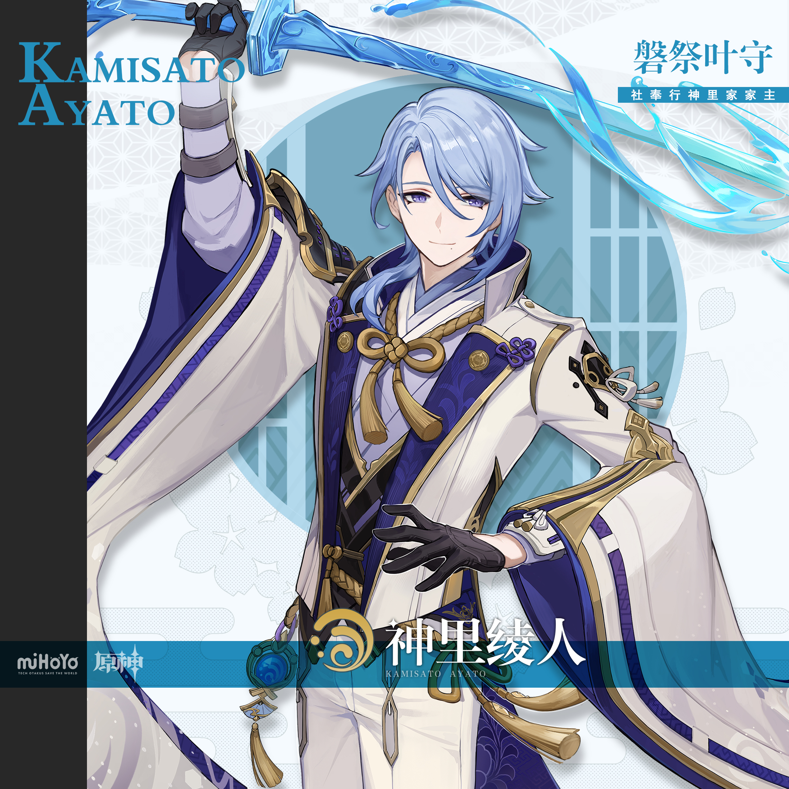
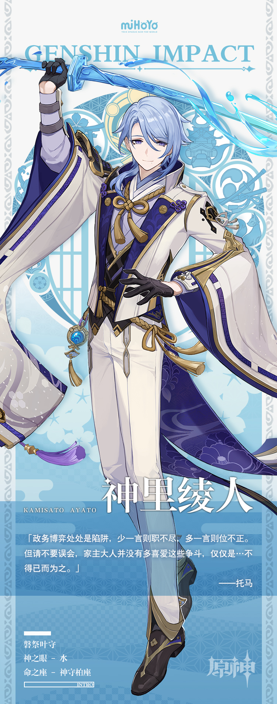

# 磐祭叶守，新翠荣枝

作为现任社奉行，神里绫人致力于维持地区的繁荣和时局的稳定。

表面上看，他处世低调，优雅得体，不爱出现在公众面前，也绝少显山露水。

可了解他的人，绝不敢对他掉以轻心——早在前任社奉行病倒，神里家摇摇欲坠之时，正是年轻的他稳住了局势。

若无超凡的手腕与极深的城府，他不可能获得如今这般地位。滴水不漏的微笑背后，或许藏有暗涛。

然而奇妙的是，在大部分有他参与的多方博弈里，他不放肆掠取，也不争强好胜，甚至愿意出让利益，让每个人都能分得一块相对满意的蛋糕。

「他究竟在盘算什么？」事成定局后，偶尔会有人这么想。

不过，既然已经得到蛋糕，神里绫人的心思，便不那么重要了。