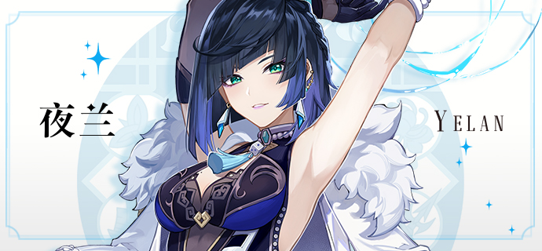
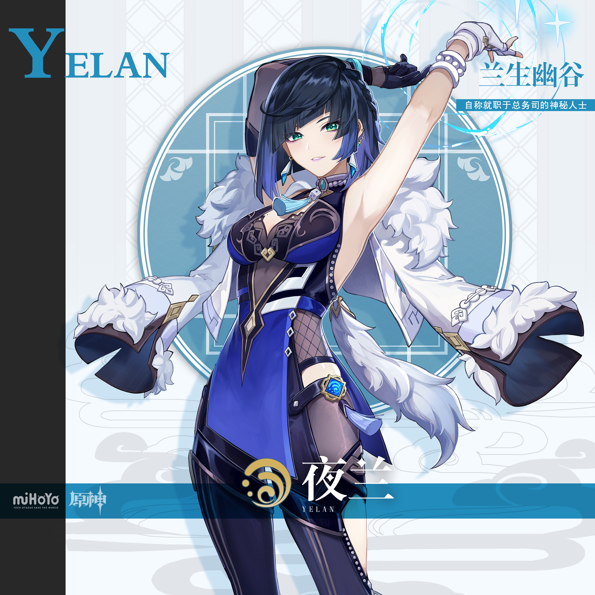
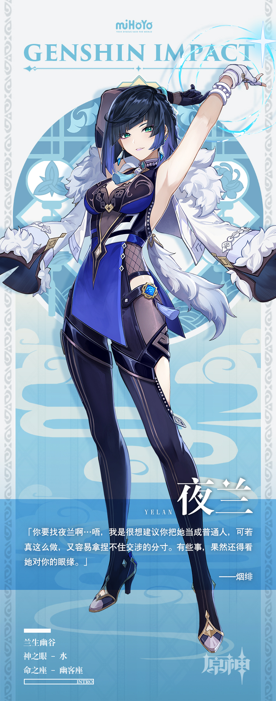

# 天地一渺渺，幽客自来去

夜兰的身份总是成谜。

她像一道幽灵，常以各种面目出现在各色事件中心，又赶在风暴停歇前消失无踪。

被卷入麻烦的人们期盼遇见她。不知为何，他们中的大多数都认为她会帮助自己，再不济，也想让她成为自己的同盟。

可麻烦的是，他们的对手也抱有同样想法。

这些人中的每一个都遇见过顶着不同名字身份的夜兰，每一个都自认能与她达成合作，每一个也都被蒙在鼓里。

她究竟想帮助谁？她什么时候才会说出真话？

一旦她开动脑筋，混入事件，总是没有真话的。

而等她卸下假身份，变得坦诚时，那些渴望答案的人又未必有机会听了。