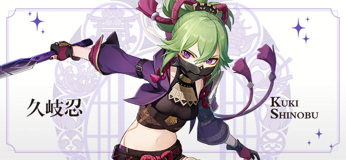
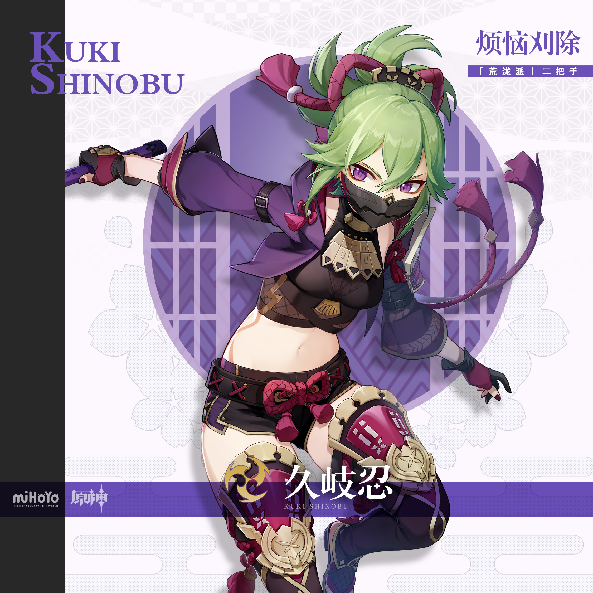
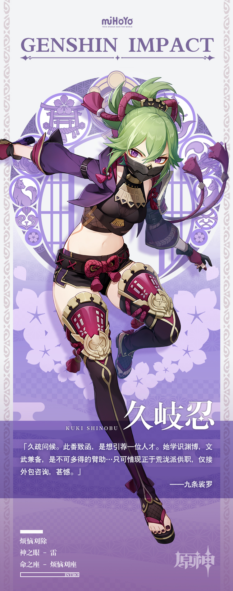

# 百业通才，鬼之副手

「荒泷派」的二把手。脸上戴着一只造型别致的面铠，不苟言笑。

加入荒泷派较晚，却是改变整个帮派的厉害人物。她来之后，帮派业务范围拓展到了各行各业，包括不限于：律法咨询、商务洽谈、宴席承办、衣饰订制…

更令人惊异的是，散漫的荒泷派竟能出示所有相关执业证书，署名处全是同一个名字：久岐忍。

据说这位二把手曾游学国外，又据说她与天领奉行交情匪浅。

外人听了这些，难免产生诸多猜疑。可那些常跟荒泷派打交道的花见坂居民们就不一样了，总是安心放心省心地赶去向她咨询各种事。

在他们看来，与久岐忍的合作洽谈总是顺利且高效的。

只要时刻谨记以下两条守则：

一、不要追究她面铠下的真容；

二、不要问为什么每次出工，都要特意绕开鸣神大社。
