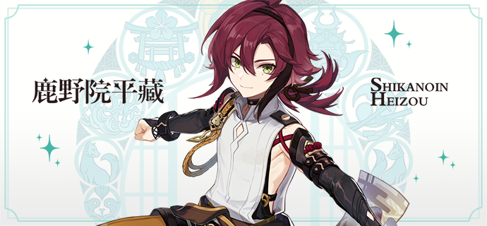
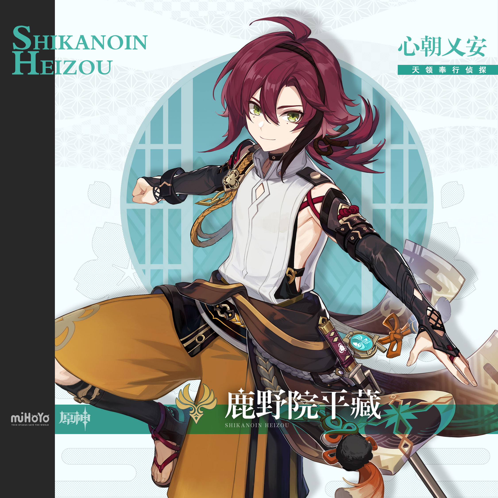
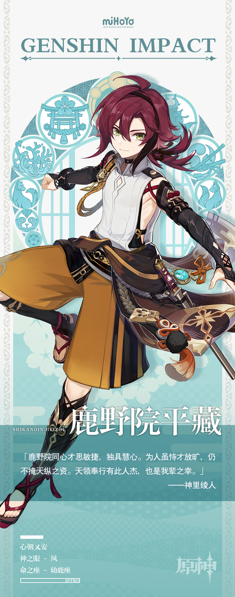

# 天衣但无缝，也惧凉风吹。

天领奉行的少年侦探，自由散漫，开朗活泼。

乍看只是个毛头小子，实际上却是天领奉行无可争议的破案第一人。

他身上不仅兼具天马行空的想象力与细致缜密的逻辑推理能力，更拥有令旁人惊叹不已的探案直觉。

每当罪案发生，同僚们尚在依靠经验寻找办案方向，他却已经从意想不到的角度切入，进而追逐到正确答案。

人们都被他超敏锐的直觉折服，称那份思维与效率简直像是得到了神明点拨。这时，平藏便会摆出他招牌的自信笑容：「说不定，这是连神明也没法办到的事哦！」