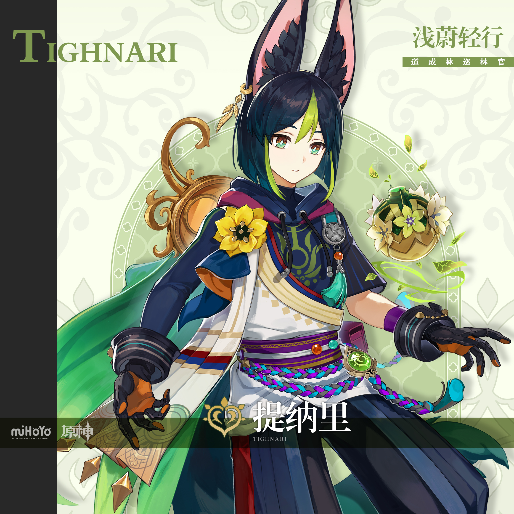
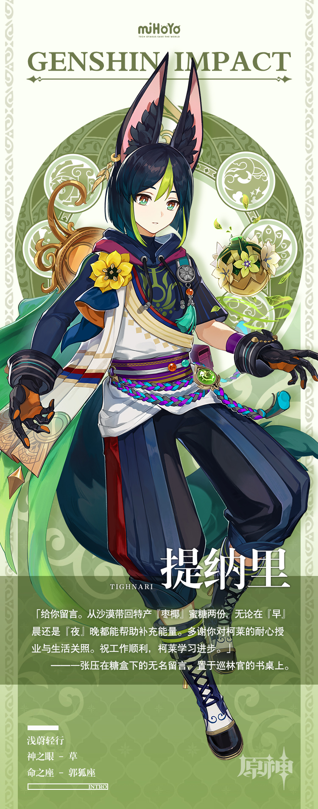

# 幽林狐影，葱茏随行

在道成林不幸遇难的人如果能遇到名叫提纳里的巡林官出手相助，是件幸事。

但若是自己犯蠢惹事陷入了麻烦，那恐怕就要喜忧参半了。

提纳里会用最专业的手法迅速解决难题，与此同时，也会以最严格的态度教导对方。

正所谓小看雨林的人总会在林中连滚带爬，小看巡林官的人也终将直面「野外生存技巧大讲堂」的洗礼。

以上均为坊间传言，但实际上，与提纳里打交道不必太有压力。只要是头脑清醒的人，就一定能听懂提纳里那些通俗易懂的讲解。

至于屡教不改的人嘛——

「可惜了，我主修的是植物学，帮人长出脑子不是我专业所在。」
