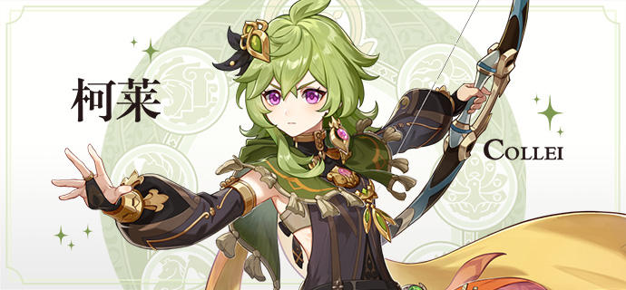
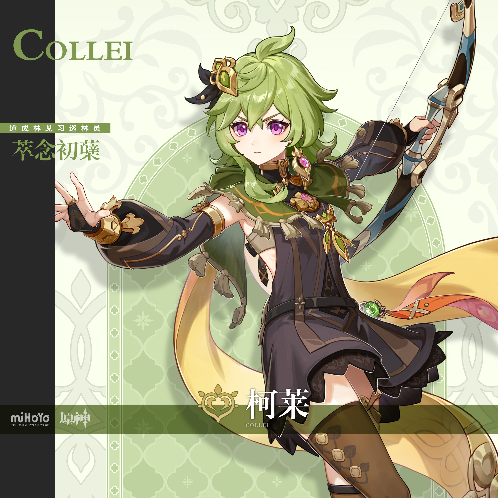
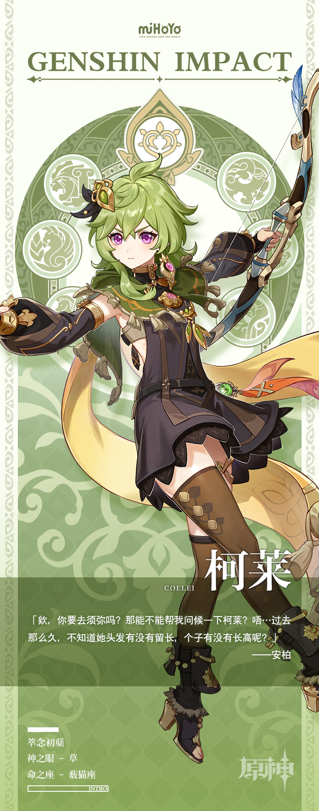

# 成长，即是战胜过去

活跃于道成林的见习巡林员。积极乐观，热情善良。

柯莱是须弥人，但很少有人知晓她来化城郭前的经历，而她自己也绝口不提任何往事。

或许是因为柯莱的眼神清亮，言行认真，众人只当她的保留是性格使然，并不会由此而对她有所疏远。

化城郭的孩子喜欢看她缝制玩偶；道成林中的迷失者愿意跟随她重返安全区。

重返须弥至今，柯莱用实际行动赢得了人们的信任与尊重。

不过，夜深时分，她偶尔还会想起被她深深藏起的往事。

尽管现状安好，她也依然希望自己能再努力一些，快快进步。

——这样才能尽早战胜过去那个软弱的自己。
