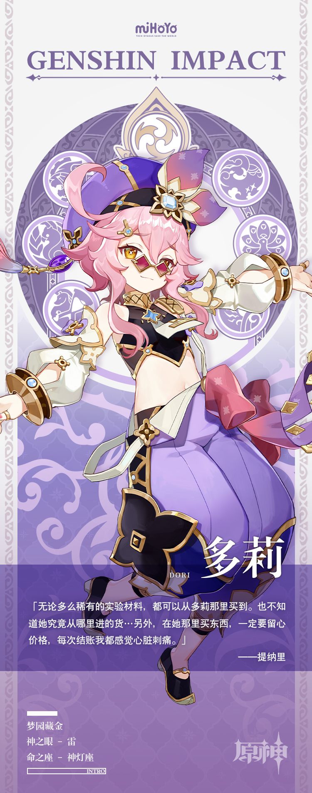

# 摩拉多多，快乐多多！

神出鬼没的多莉似乎有数不清的宝贝。

作为须弥「最有门路」的大商人，无论是世所罕见的宝石、存货稀少的药材，还是旁人闻所未闻的奇特道具，她都有办法搞到。

当然——售价绝不便宜。多莉总是脸上洋溢着热情笑容，报出的价格也总是令人瞠目结舌。

有人将她视为救急解困的及时雨，也有人把她当做趁火打劫的大奸商。

不过这些议论声都难入多莉的耳朵。能在卡萨扎莱宫内回荡的，向来只有摩拉敲击时清脆的声响。
