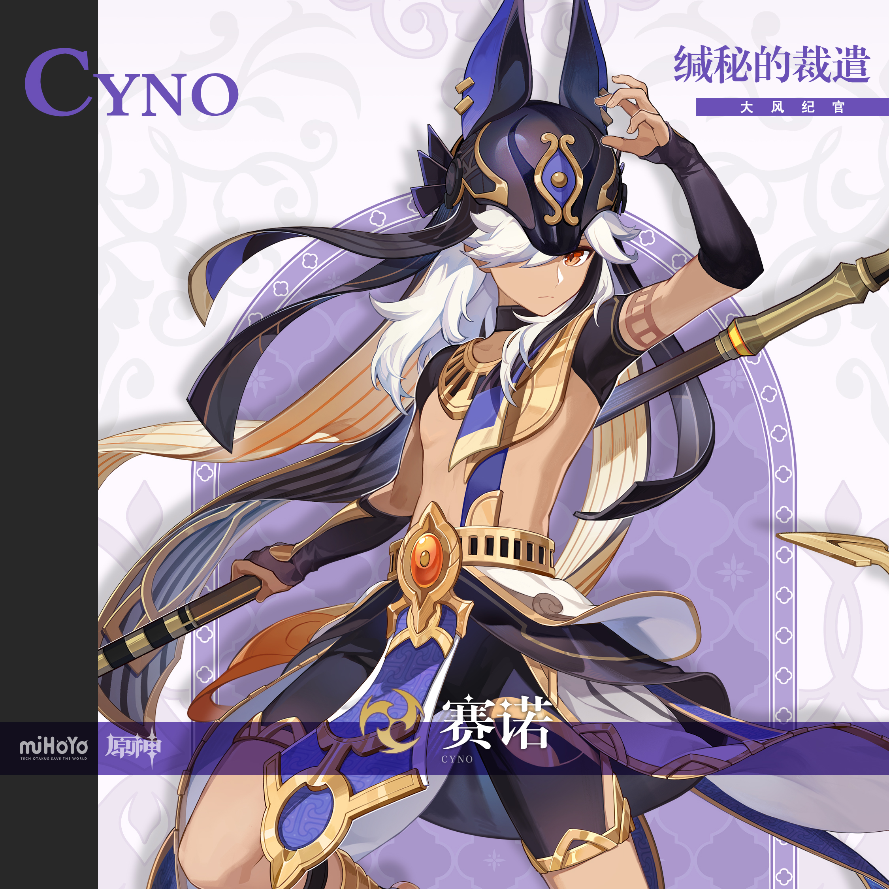
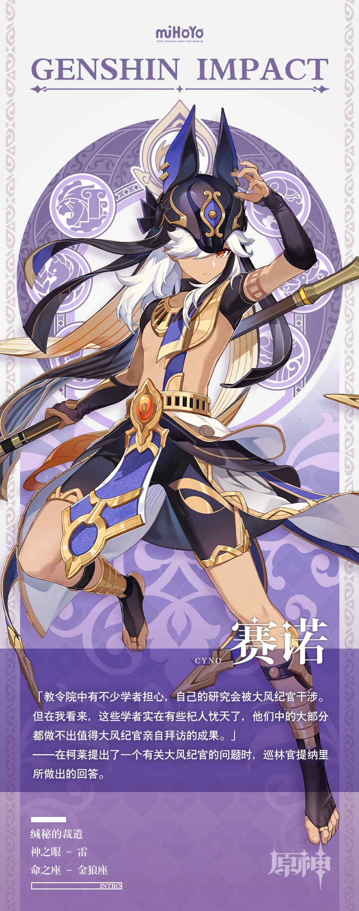

# 峻法慎后，裁遣不贷

在教令院中，如果一位学者需要和大风纪官赛诺进行正式会面，那他一般不会得到什么好消息。

通常来说，赛诺的亲自到访意味着这些学者们犯下了抄袭、贿赂、学术舞弊、虚假申报、挪用经费、恶意竞争、侵改论文撰稿人等重大学术罪责中的某项…这些学者唯一能做的，就是跟随大风纪官前去接受审判。

但这些学者并不会那么轻易地接受这个事实。

他们中的大部分人会试图用摩拉来动摇大风纪官的决心，这群「有钱人」在接受审判时会按律罪加一等；小部分人会选择用武力进行一次不理智的顽抗…在为自己的不理智付出相应的代价后，他们在接受审判时也会按律罪加一等。

某些黔驴技穷者，甚至会装疯卖傻，以自己的记忆力和脑子两者中的一个出了问题为由，试图做出最后的挣扎。

但大风纪官赛诺对付他们时依旧很有耐心，用他自己话说——

「作为风纪官，帮助人『记』起自己犯下的错误，也是我的职责之一。」