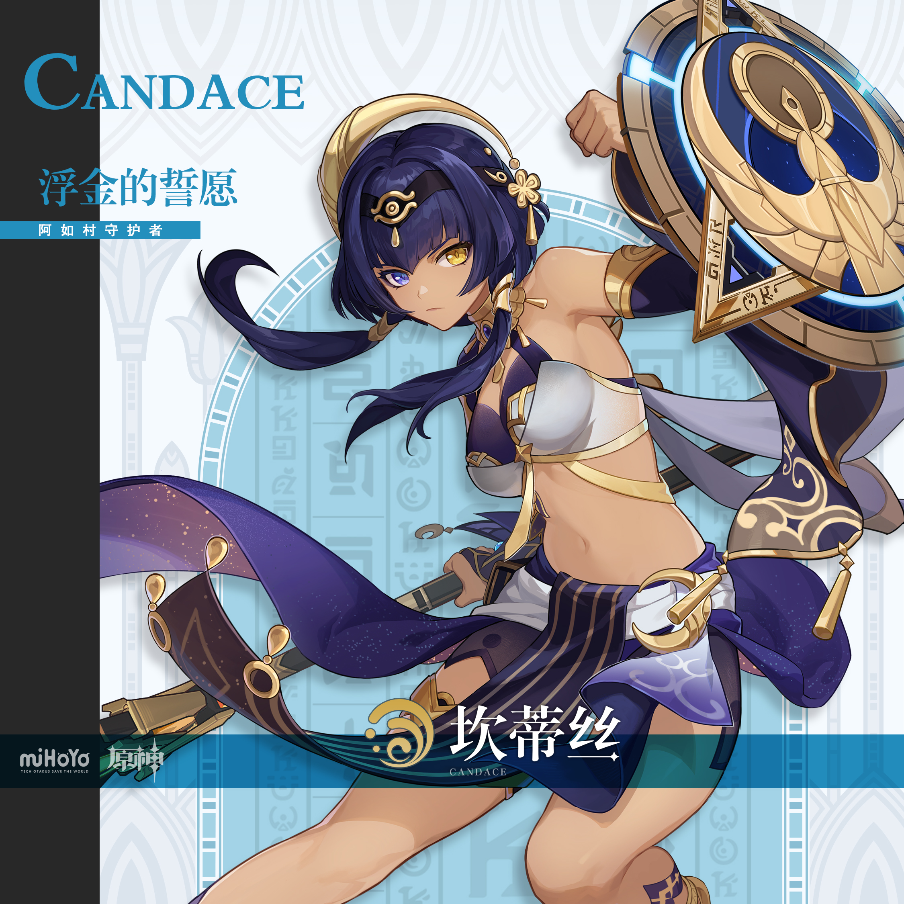
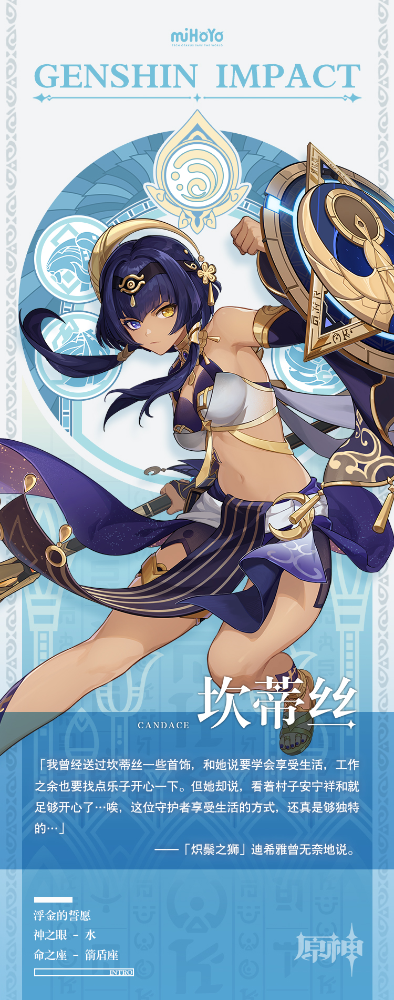

# 赤沙浮金，恪誓戍御

「那个坎蒂丝是…是真正的赤王后裔！」

在须弥城的酒馆中，一位狼狈不堪的镀金旅团成员哆嗦着说道。

那位拥有异色眼瞳的守护者有着神灵的祝福，能够召来漫天的沙暴，瞬间吞没所有敌人。

一个刚宣布自己金盆洗手的盗宝团成员在旁补充，坎蒂丝还能使唤沙漠的力量，每一颗沙砾都是她的斥候，在沙漠中，没人能从她手中逃脱。

但一位准备再次奔赴沙漠的年轻冒险家却奇怪地说，阿如村的「守护者」坎蒂丝小姐，明明是个温柔和善的人啊。

他曾造访阿如村，亲眼见过坎蒂丝小姐给一个饥渴交加的盗宝团成员送上了水和食物，又安排另外一位精疲力竭的佣兵去客房休息…在他眼中，这位守护者和「恐怖」两字压根沾不上边…

远在大赤沙海中的坎蒂丝并不知道这场有关于她的小小争论——她也并不在意外人对她的议论。

作为阿如村的守护者，她的职责是维护阿如村的安宁。

只要遵守村内的规则，任何人都可以在阿如村内悠然歇憩，并且得到合理的帮助。

而那些不守规则，在村内行不法之事者。

坎蒂丝会亲自确保，他们再也不会有危害村子的机会。