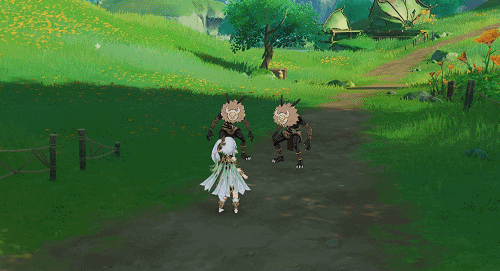
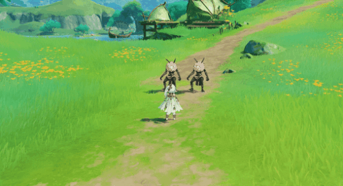
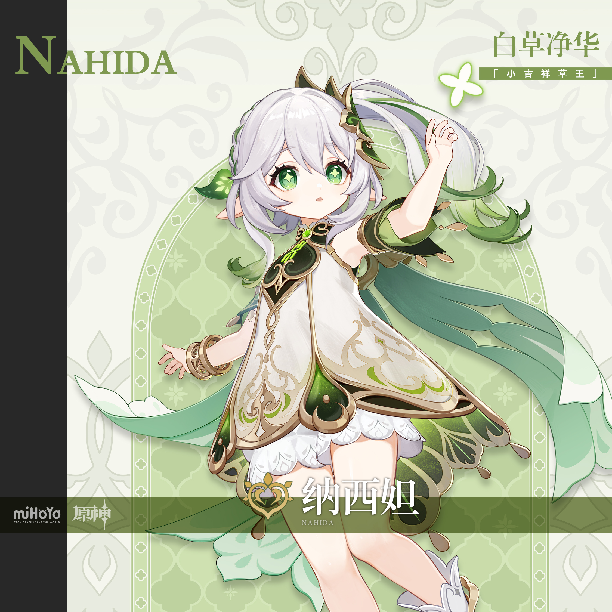
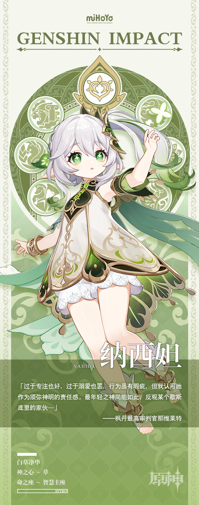

# 「白草净华，幽宫启蛰」

「小吉祥草王」深居净善宫内，向来不受重视，也很少被人提及。

她一刻不停地学习各种知识，只为更快成长为一位合格的神明，尽早地开始引导国民。

若不是「禁忌」的威胁日渐临近，她又何尝不想暂时休憩，亲眼去看看须弥的无数生灵？

现在的她，只能于梦中遍览五彩斑斓的世间盛景。

在心灵的净土中，她与阳光和微风作伴，与人类和动物交友，一起讲故事，做游戏，唱刚刚学会的歌…

她将最美好的向往尽数倾注于梦境，但无论夜晚如何喧闹，每当白日来临，她的身畔又会重归寂静。

她悠悠起身。睡眼惺忪之际，孤独突如寒潮般袭来，她不由得抱紧了双肩。

——彻底唤醒她的，是来自「虚空」并不明显的异响。

「原来是，梦中梦啊…」