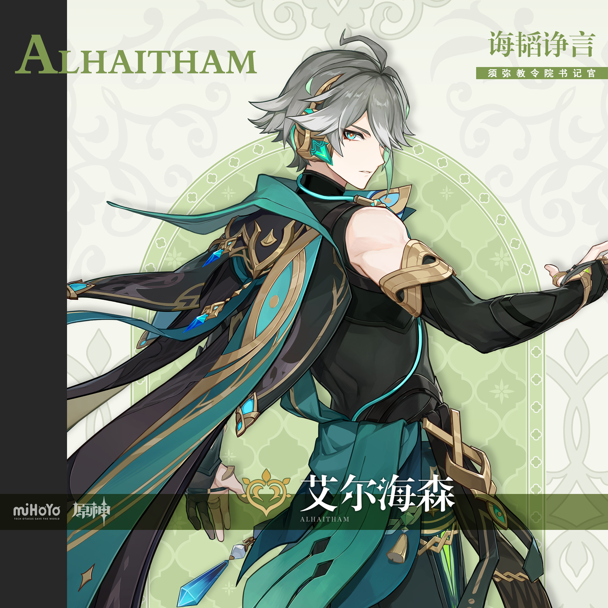

# 「学识、思考及处事之道」

须弥教令院现任书记官。拥有一个听起来非常厉害的头衔，不过这也是拜院内起官名好面子之风所赐。

书记官一职看似来头不小，事实上既不跟随所有重大会议，也不参与核心事务决策，只负责归档备份重要资料，没事根本不需要出面。可正因如此，在纸质书及书面文件一度受到管理的须弥，书记官反而是整个教令院知道最多事情的职能之一。可以说，这一职位与大掌书定位较为相近，人们从来不会否认大掌书身为管理图书之人最有机会接触记录了顶级智慧的书籍。

现任教令院书记官艾尔海森完美符合以上标准——没多少人知道他是谁，他却知道许多旁人毫不知晓的信息。他不参与任何非必要会议，开会时除必要事项也都是看心情记录。人们不常把注意力放在他身上，更不知道这位书记官能在一次简单的会议中察觉到多少细节。

一个有能力的人保持低调太久，总会被认为有什么深藏不露的身份和目的。艾尔海森本人即是对这一切无趣观点的有力反驳：他足够优秀，但只是一个普通的教令院职工，在须弥拥有稳定工作和优质房产，过着轻松自在的生活。