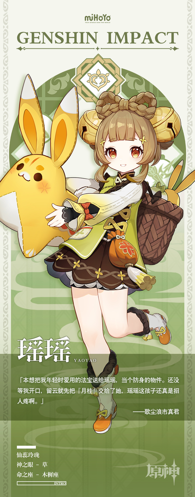

# 「玲珑玉质，身含仙骨」

在璃月港居民眼中，萍姥姥总将乖巧爱笑的瑶瑶带在身边，两人俨然一对亲密的祖孙。

但其实这一老一少毫无血缘关系，瑶瑶是萍姥姥——或者说歌尘浪市真君的弟子。

明明是真君膝下最年幼的弟子，她却总是像大师姐般照顾着同门子弟。

难怪师姐香菱时常犯嘀咕：「怎么有种被瑶瑶当成小孩子照顾的感觉…到底谁是谁的师姐呀？」

早在拜入师门之前，瑶瑶就已经是热心体贴的性子，或许正因如此，她颇得众位仙人喜爱。

从不离身的「月桂」就是仙家之物，由留云借风真君亲手打造。一旦瑶瑶遇险，「月桂」便能保身护命。仙人们对她的青睐，可见一斑。

再加上瑶瑶天资聪颖，积极好学，如此良材更令师长有所期待。虽然她年纪幼小，所学知识尚且不能融汇贯通，时常闹些笑话，但假以时日，无疑会成长为学识渊博的女子。

有这样的弟子陪伴，萍姥姥深觉宽慰。