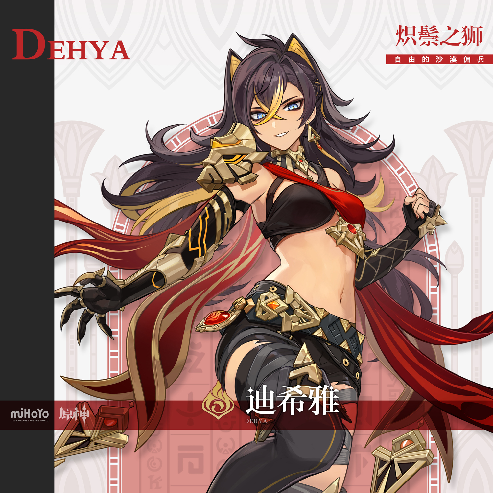
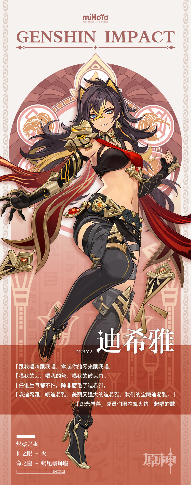

# 鹫鸟的眼睛，狮子的灵魂，沙漠自由的女儿

松散的佣兵组织「镀金旅团」是须弥最强大的武装力量，其内部又有许多独立承接委托的佣兵和佣兵团。

「炽光猎兽」就是其中之一，他们团内最出名的成员是号称「炽鬃之狮」的迪希雅。

勇敢但不鲁莽，强悍却不傲慢，迪希雅是佣兵圈子里有名的战士。在严苛的沙漠生活中，她积累了大量的战斗智慧，绝不是粗野愚笨的普通武人。

只要出价够高，委托内容合理，她的剑就可为雇主所用。

不过同时雇主们需要明白，他们只是靠摩拉与迪希雅结下了短暂的契约，驭使这头狮子的缰绳不在他们手中。

没错，佣兵是出卖武力过活的人，但他们的人格和生命只属于自己。

沙漠的狮子不是任何人的奴仆，她的剑随心而动。