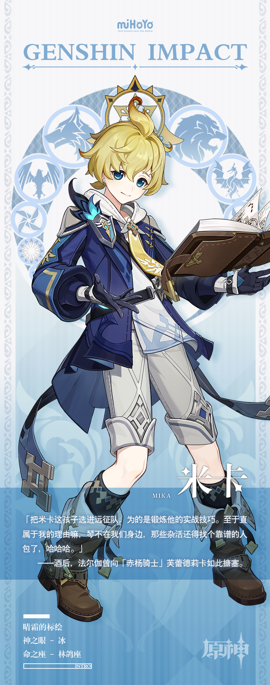

# 翎羽如穗，绘摹殊境

所属西风骑士团游击小队的米卡，尽职尽责地完成着各类从天而降的工作。

搭建营帐、生火做饭、维护装备…就连后勤队长赫塔都要对米卡的出色效率予以肯定。

米卡所表现出的任劳任怨并非因为他性格软弱，不善拒绝他人的要求，而是他发自内心地重视团队合作，将自己定位为需要向强者不断学习的后辈。

「帮大家跑跑腿，力所能及，还能提升团队的整体收益！」

而米卡自己最喜欢的事，与他身为「前进测绘员」的本职是密不可分的。

那便是：勘查陌生的区域，记录地形数据的细节，绘制出精准有效的地图。

「此处为一资源富集点，但周遭有魔物聚集，需谨慎。」

梦想着成为绘制地图专家的米卡，此刻，又为笔下的新版军用地图添加了一条注释。