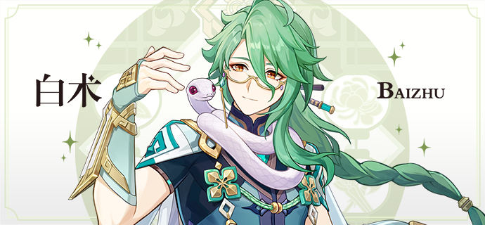
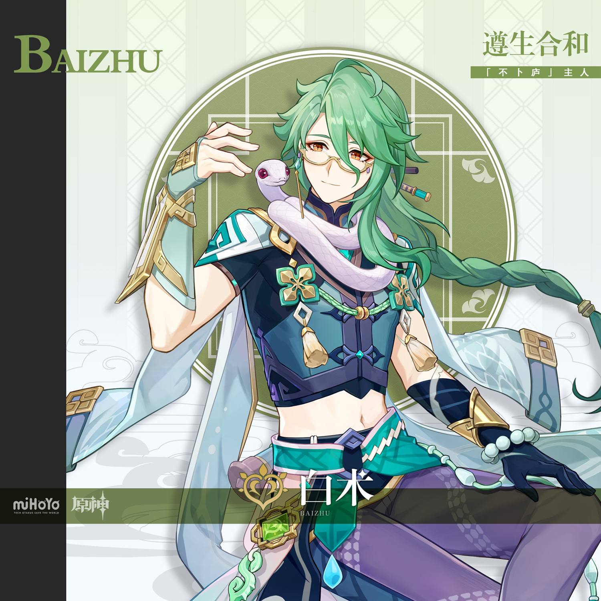
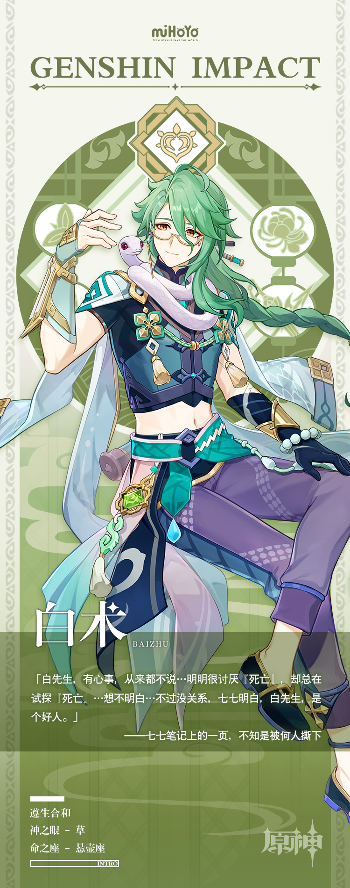

# 生老三千疾，何处可问医

「璃月有间不卜庐，庐里有位白大夫。妙手回春百病除，就是开的药——太苦！」

这首童谣在绯云坡流传甚广，被无数家长用来告诫孩子不要生病，否则有的是苦头吃。

然而，童谣中的主角似乎并未因此遭到孩童惧怕，反而经常被亲昵地唤作「白术哥哥」。

这种印象大抵要归因于白术的温雅举止与亲切谈吐。不论男女老少，与他相处都感觉如沐春风；不管是多焦急的病患，看到白术智珠在握的微笑，心里也会安定一些。

只可惜，白术也不是什么病患都能救的，譬如他自己。

「不卜庐」药师阿桂曾提过，白术的身体状况奇差无比，坐诊后常回住处调息静养。即便如此，他也从不在人前卸下微笑。

阿桂问他，他说：医师若是一副病恹恹的样子，求医的病人又怎能有信心面对疾病呢？

白术日日如此，光看他平日的笑脸，也不知已在人后独自服过多少苦药，又尝过多少苦果。