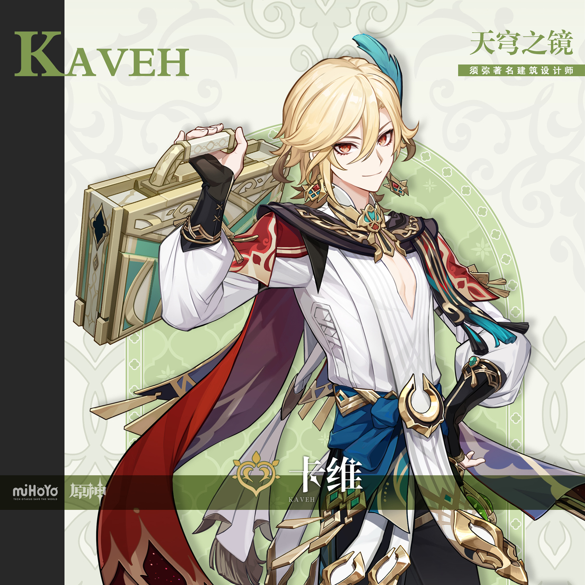
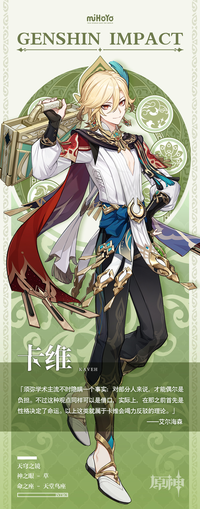

# 体悟、仁爱与识美之知

须弥著名建筑设计师。被誉为妙论派之光，是业内最受瞩目的人物之一。

作为设计师兼优秀校友，卡维在教令院学子中名声不小，会被妙论派学弟学妹视为职业楷模。不过很可惜，他的职业生涯并不是人们想象中那么一帆风顺。同样的情况似乎也发生在卡维人生其他方面。

光环、传闻、名誉…一切不过是附属品。卡维专业设计能力远超常人，倾注心力于工作，对美学和建筑学本身充满理想与追求。设计师并非最终的建造执行者，却要对所有环节负责，再三确认设计细节、安全性、实用性等方面。而卡维作为同行中的佼佼者，更会在这个过程中关注他所在意的艺术及人文要素。对他来说，完全脱离现实的设计应当被归为幻想，真正投入建造的建筑必须拥有其实际价值。

话说回来，这样一位优秀建筑设计师居然能靠一个项目把自己弄破产，实在不可思议。幸好这件事知情人很少，相关人士大多不约而同保守着秘密。至于卡维自己，更是如惊弓之鸟般生怕破产一事走漏风声。他如今的生活与理想相比起来，称得上天差地别。