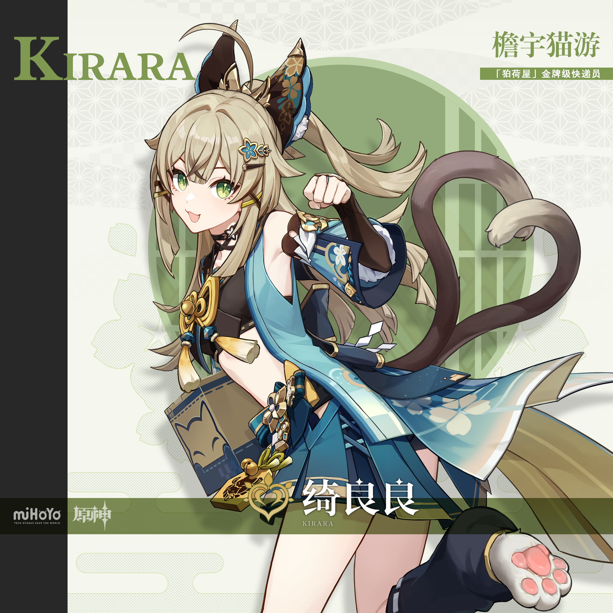
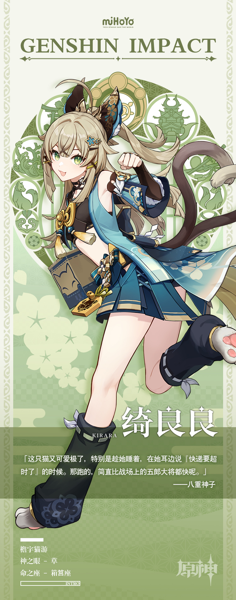

# 歧尾骏足，通达万户

稻妻知名快递公司「狛荷屋」，聘用着一名有些特殊的员工。外表看起来是位打扮甜美的少女，背后却长着两条尾巴。她对待顾客大方得体，但私底下为了不让快递超时，时不时就会从房檐上悄无声息地窜过…

起初，她身为「妖怪」的事实免不了让大家议论几句，但伴随着「绮良良」一次又一次真诚而响亮的自我介绍，敬业负责、贯彻始终的工作态度，人们不仅打消了疑虑，更是发自内心地感激起了这位妖怪少女。「安全准时」、「服务到位」、「活泼可爱」…这三条是在「反馈栏」里出现频率最高的评价。据说，如果能给她一个五星好评，或是送她一些小零食的话，还能看到这位少女满脸激动，尾巴在身后开心摇晃的样子。

对绮良良自己来说，这份工作如同珍宝。她热爱着人类社会的一切，心醉于客户们收到包裹时脸上露出的笑容。为此，她拼命地为每名顾客献上最好的服务——毕竟，要是一个不小心被公司开除的话，她就只能回荒山野岭做人们口中的「大妖怪」了。

好在「狛荷屋」老板从没有过这样的念头，反倒私下问过绮良良是否要拿更高的工资，做更轻松的文书工作。绮良良听后赶忙摇头拒绝。她没好意思告诉老板：每去一个不同的地方送货，对她来说都是一次公费出游呢！