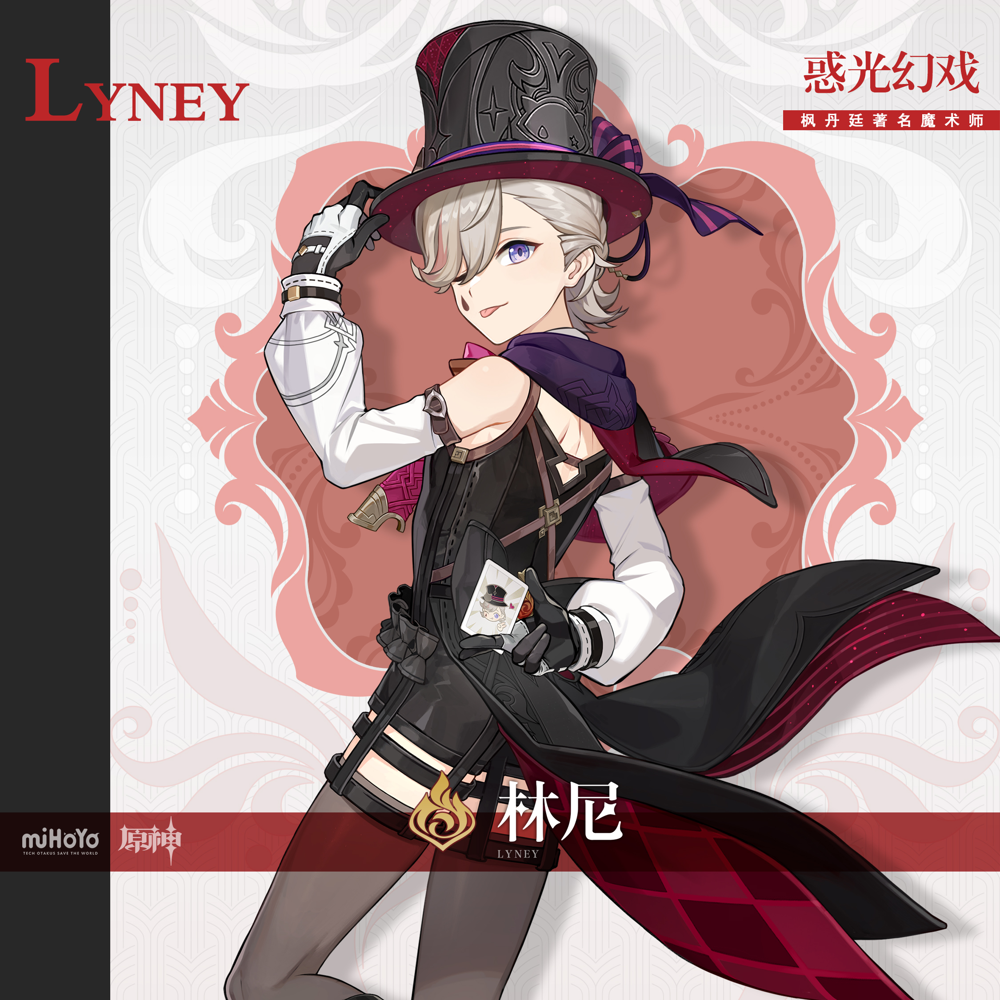
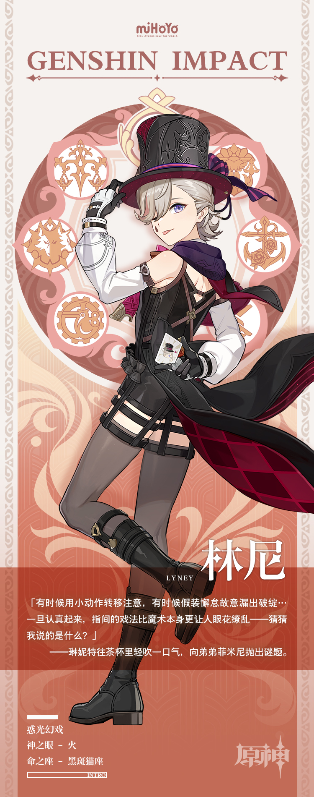

# 镜中捧花，赠予何人

枫丹廷最值得一看的演出，除了「欧庇克莱歌剧院」的审判，当属林尼与琳妮特的魔术节目。

「审判」以真相裁量正义，「魔术」以假象打动人心。

即使所有观众都心知肚明，台上的一切不过是机关巧筑和手法矫造，可当「奇迹」真的出现于眼前时，还是不由神摇目眩。早在魔术师以优雅的动作谢幕之前，众人的掌声与喝彩就已响彻天空。

在台上，林尼是万众瞩目的大魔术师；在台下，他则是可靠的兄长、友善的客人、热诚的朋友。

他的一举一动总能给人意外之喜，一言一行总能令人会心一笑，似乎是全身上下都装满了让人猜不中又好奇不已的甜蜜礼物。

如果在不知不觉间，发现自己已经与他成了无话不谈的交心之友，还请不要惊讶。

——毕竟魔术师，可都是偷心的专家呀。