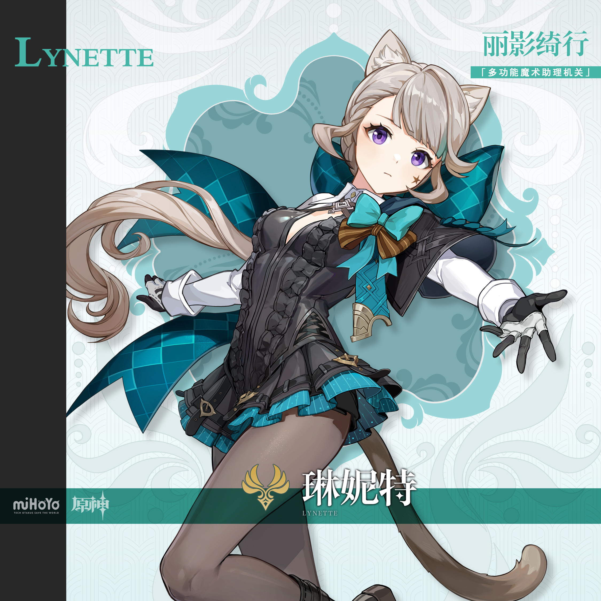

# 水中窥月，洞见夜明

与那位自称「全提瓦特最棒的大魔术师」的兄长不同，琳妮特恐怕是全提瓦特最低调的魔术助手。

她从不追求鲜花与喝彩，甚至有意避开采访与关注。

外界对她或是好奇，或是招揽，都被她用「已进入待机模式」、「今日需要发呆」之类费解的话拒之门外。

即使有地位颇高的观众登门造访，琳妮特也总是往后一躲，让林尼出面接待。而她则会泡好一壶红茶，坐在一旁默默垂眸啜饮，似乎对会话漠不关心。

只有极少数的客人，能在与林尼畅谈的隙间，察觉到一丝转瞬即逝的锐利视线。但想要追寻视线来源时，却又茫然无踪。

在场者只有盛情依旧的林尼，与自始至终都在专心品茶的琳妮特而已。

…或许只是错觉吧。

…即使不是错觉，只不过是被谁多看了一眼，又能看出些什么呢？