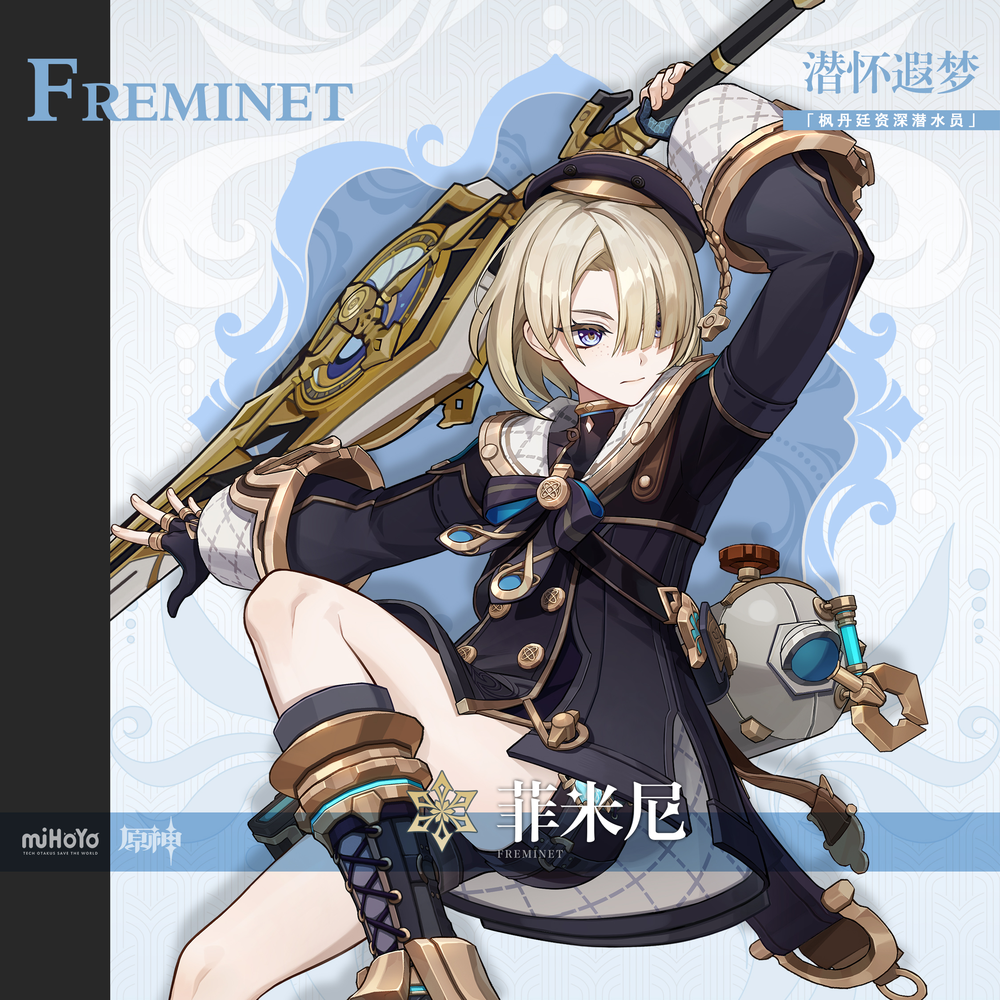
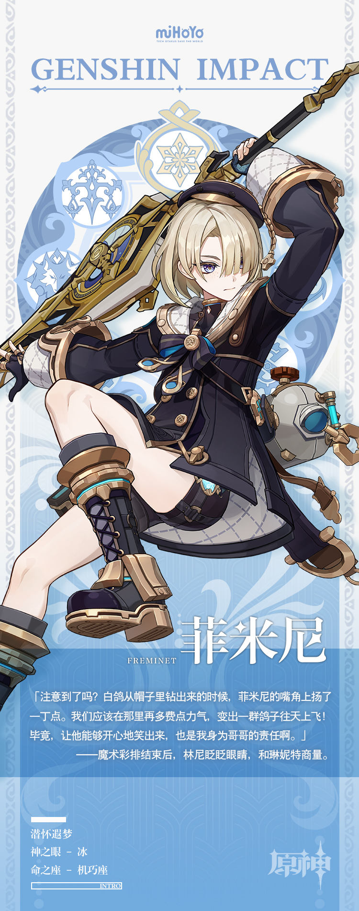

# 繁星丽天，孤怀寒芒

作为水之国度，枫丹的海底风光可谓壮丽奇谲，但并非每个人都能获得进入水下世界的门票。即使对于掌握了基本要领的人来说，潜水仍是乐趣与挑战并存的冒险活动。在众多潜水员之中，菲米尼以其出色的专业素养、持久的水下专注力和丰富的水文知识储备受人信赖，只可惜，独来独往的他似乎从不接受来自外界的委托。

身为枫丹著名魔术师林尼和琳妮特的弟弟，菲米尼并不爱站立在灯光之下。他人的目光、反应与评价总会让他呼吸的节奏变得紊乱。他更喜欢躲进海里，在轻微的失重感中向海露花吐露心事，分享彼此的温度。

他看似冷淡，实则是他的情感随他一起沉于海中。