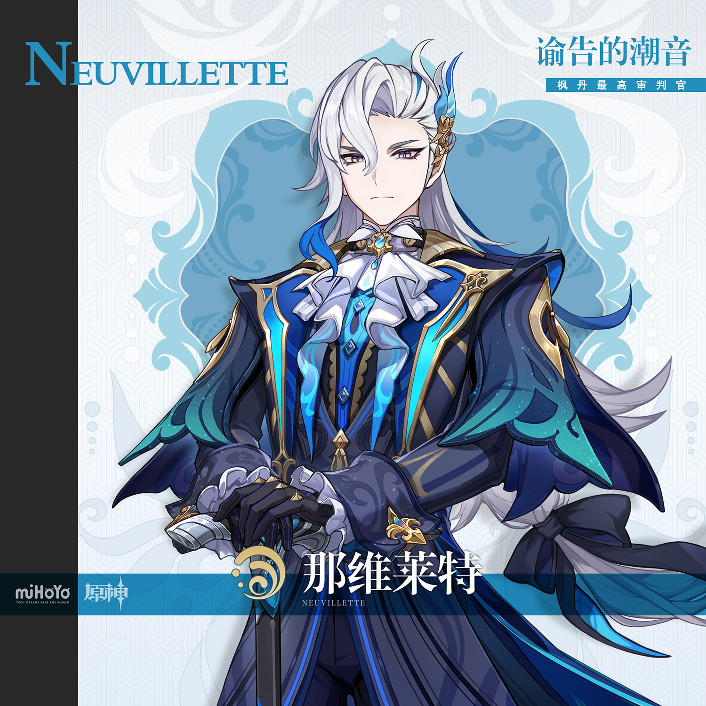
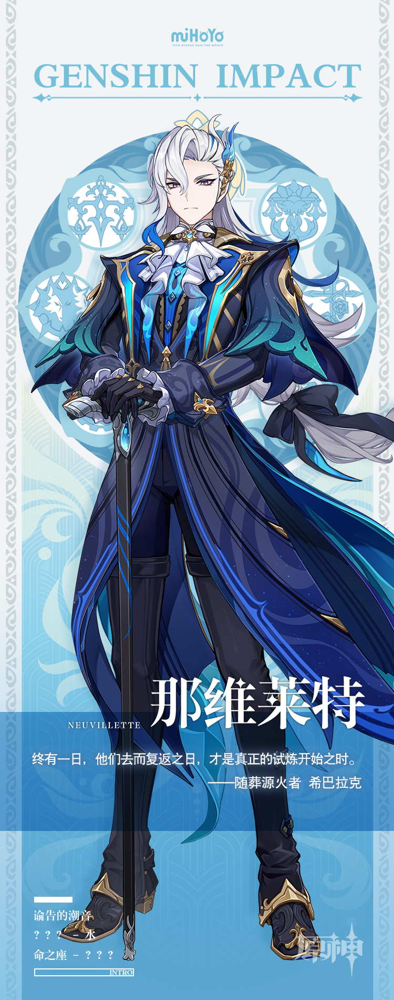

# 凡高大者，无不蔑视

「之前对于水神大人的秘辛专栏让得本报荣获了那维莱特先生『什么地摊小报』的评价，这次我们聚焦神秘的最高审判官先生。对于他最真实的个性我们知之甚少，几次采访申请也被拒绝，所以我们采用了对大众征集的形式获得最真实的材料。我们刨除了匿名投稿与一眼真实性不高的来信，力求真实。下面是一封字迹很可爱的来信：

……

『比如这个世界真的有暗夜英雄，那暗夜英雄应该只是这个人的伪装。他早上起来刷牙的时候，还是自己，只有半夜才会变成暗夜英雄。但是那维莱特（先生）不是这样的，最高审判官是真实的他，我们美露莘理想中的好爸爸也是真实的他，唯独那维莱特这个名字下的人不是他。』

从这里我们可以知道，那维莱特是唯一的男美露莘！尽管美露莘种族的出现时间远远晚于那维莱特出任的时间，但是在铁证面前，这些都总有说法可以解释。」

——地摊小报《七国四海邮报》