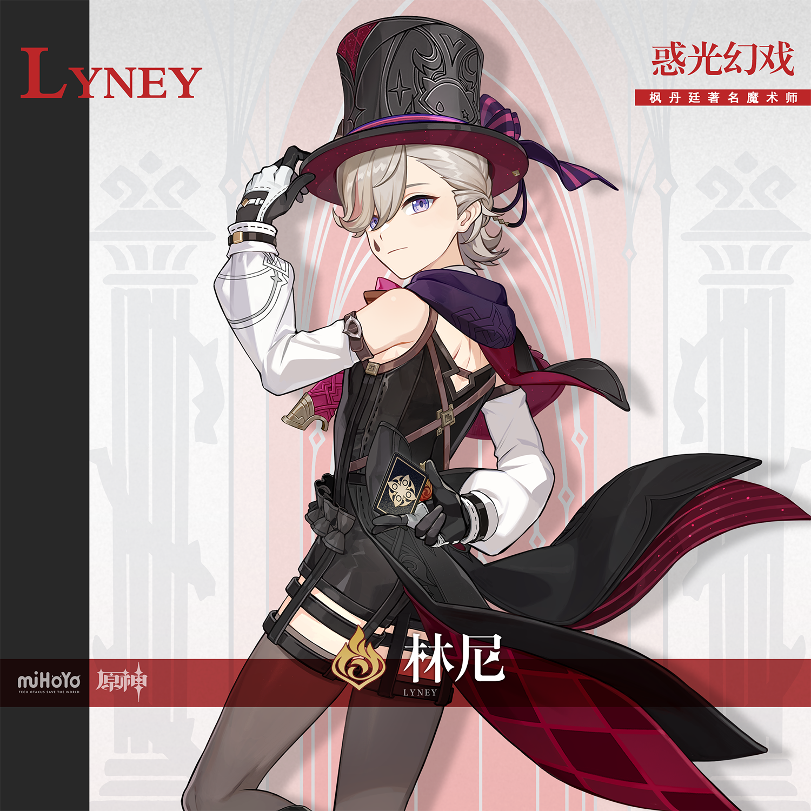

# 镜中捧花，赠予何人

魔术即是谎言。设计手法，巧布迷阵，掩人耳目。

要编造一个假象，需要前前后后数个谎言来铺垫圆场；要变好一场魔术，需要林林总总无数设计来取信观众。

道具、灯光、助手、筹划…台前幕后无数人的协力，一起为魔术师搭出最理想的舞台。魔术师的表演，牵连着无数心血，背负着无数期待。

因此，魔术师的设计绝不能出错，魔术师的行动绝不能失手，魔术师绝不能辜负身后「家人」——

「…『魔术师』的谎言，绝不能被揭穿。」

第一次带着「任务」来到台上的林尼，站在帷幕之后，小声重复着「父亲」的嘱咐。 

「林尼…」琳妮特不自觉地攥紧了林尼的掌心。

帷幕缓缓升起，魔术即将开演。林尼举起琳妮特的手，回以坚定的眼神。

「我没事。因为我的身边，一直有琳妮特在。」