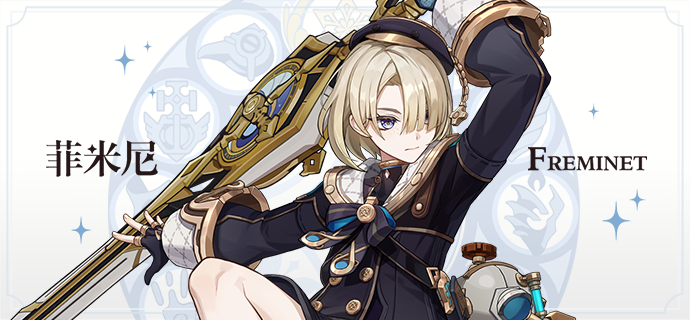
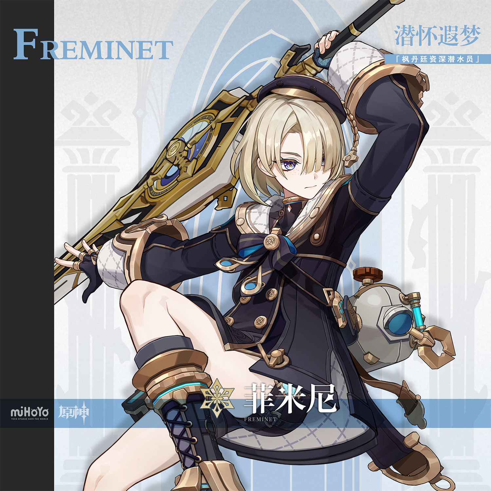
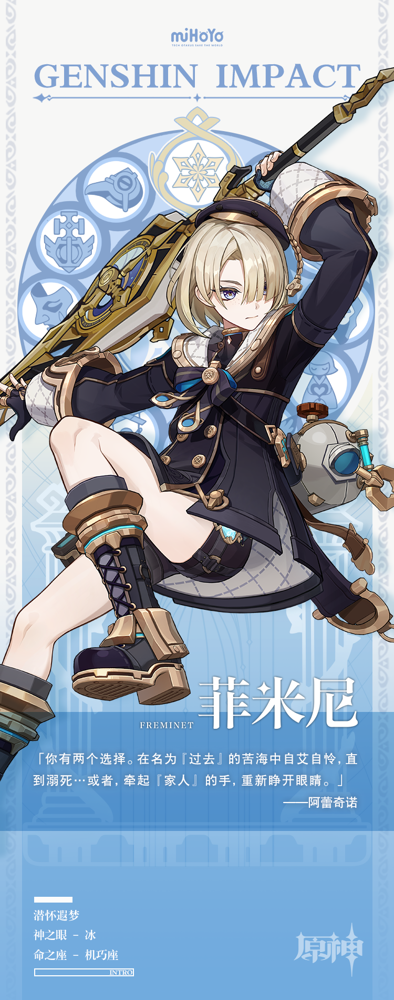

# 繁星丽天，孤怀寒芒

早年，菲米尼总是习惯独来独往。彼时的「壁炉之家」常常利用他看似柔弱的外表让敌人放下戒心，安排他只身深入敌阵，以简洁而不留情面的手法完成任务目标。

「只需要戴上头盔，隔绝杂音，完成命令就好。」菲米尼将自己定义为一台冰冷的发条玩偶。

后来，「壁炉之家」内部发生了翻天覆地的变化。在「父亲」的安排下，菲米尼与林尼、琳妮特共同组成了「布法蒂公馆」的三人小队。起初，菲米尼常常感到无所适从。

那对兄妹的配合是如此默契，自己简直就像是一枚备用的零件，只配在暗处收集灰尘。

「菲米尼，别走神哦！你看看这个是什么？」

「佩伊的…卡牌？」

「嘿嘿，再看看清楚？就是『佩伊』哦…给，接着！这次的任务很复杂，我为这位『英雄』和你安排了非常关键的位置！具体的计划是这样的…」

执行任务很少让菲米尼的心情产生波动，倒是庆功时分，在德波大饭店第一次尝到的美味甜品，让少年的脸上露出了一抹笑容。

「我的也给你，别客气，」琳妮特为菲米尼斟满了杯中的茶，「我们是『家人』。」